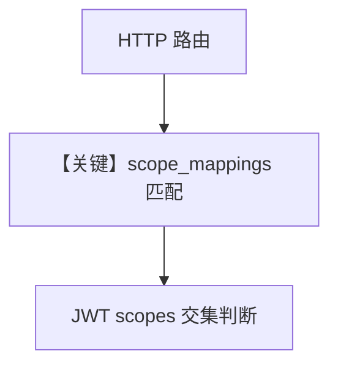

# custom_scope_mappings.py — 实现原理分析

> 源文件：`cookbook/05_agent_os/rbac/asymmetric/custom_scope_mappings.py`

## 概述

在 **asymmetric/basic** 基础上，通过 **`JWTMiddleware` 的 `scope_mappings`** 自定义「方法+路径 → 所需 scope」；并保留 RS256 密钥加载逻辑。

**核心配置一览：**

| 配置项 | 值 | 说明 |
|--------|------|------|
| `custom_scopes` | dict，`GET /config` → `app:admin` 等 | 细粒度 |
| `JWTMiddleware` | `scope_mappings=custom_scopes` |  |

## Mermaid 流程图

## 关键源码文件索引

| 文件 | 关键函数/类 | 作用 |
|------|------------|------|
| `agno/os/middleware` | `JWTMiddleware` | 映射 |
