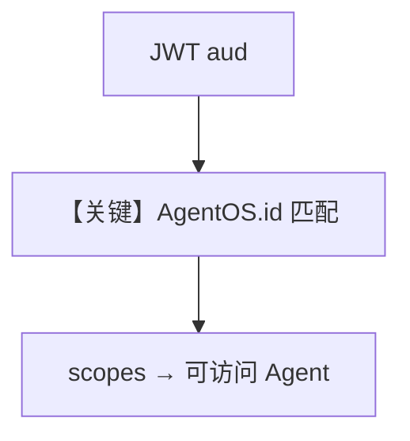

# advanced_scopes.py — 实现原理分析

> 源文件：`cookbook/05_agent_os/rbac/symmetric/advanced_scopes.py`

## 概述

本示例展示 **简化 scope 语法**（`resource:action`、`resource:<id>:action`、通配符）与 **audience**：`AgentOS` 带固定 `id`，JWT `aud` 须匹配；注册多个 Agent 以演示按 scope 过滤可运行对象。

**核心配置一览：**

| 配置项 | 值 | 说明 |
|--------|------|------|
| `web_search_agent` / `analyst_agent` / `admin_agent` | 不同 id | 权限粒度 |
| `agent_os` | `id=...` | audience |

## Mermaid 流程图

## 关键源码文件索引

| 文件 | 关键函数/类 | 作用 |
|------|------------|------|
| `agno/os/config` | `AuthorizationConfig` | 高级 scope |
