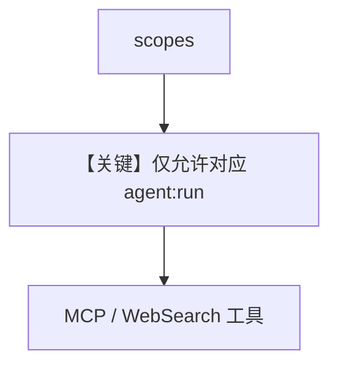

# agent_permissions.py — 实现原理分析

> 源文件：`cookbook/05_agent_os/rbac/symmetric/agent_permissions.py`

## 概述

本示例在 **对称 RBAC** 下挂载 **多个 Agent**（`web-search-agent` 与 `agno-agent` + `MCPTools`），演示 **按 Agent 划分的权限**（文档 `__main__` 中生成带 `scopes` 的 JWT）。

**核心配置一览：**

| 配置项 | 值 | 说明 |
|--------|------|------|
| `agno_agent` | `MCPTools(docs.agno.com/mcp)` | 与 web 搜索并列 |
| `authorization` | `True` |  |

## Mermaid 流程图

## 关键源码文件索引

| 文件 | 关键函数/类 | 作用 |
|------|------------|------|
| `agno/os` | RBAC + 多 Agent |  |
