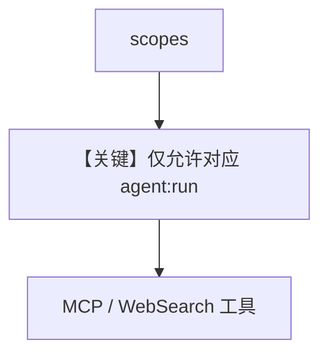

# agent_permissions.py — 实现原理分析

<!-- cookbook-py-source:start -->
## 完整源码

```python
"""
Per-Agent Permissions Example with AgentOS

This example demonstrates how to define per-agent permission scopes
to control which users can run which specific agents.

Prerequisites:
- Set JWT_VERIFICATION_KEY environment variable or pass it to middleware
- Endpoints are automatically protected with default scope mappings
"""

import os
from datetime import UTC, datetime, timedelta

import jwt
from agno.agent import Agent
from agno.db.postgres import PostgresDb
from agno.models.openai import OpenAIChat
from agno.os import AgentOS
from agno.os.config import AuthorizationConfig
from agno.tools.mcp import MCPTools
from agno.tools.websearch import WebSearchTools

# ---------------------------------------------------------------------------
# Create Example
# ---------------------------------------------------------------------------

# JWT Secret (use environment variable in production)
JWT_SECRET = os.getenv("JWT_VERIFICATION_KEY", "your-secret-key-at-least-256-bits-long")


# Setup database
db = PostgresDb(db_url="postgresql+psycopg://ai:ai@localhost:5532/ai")

web_search_agent = Agent(
    id="web-search-agent",
    name="Web Search Agent",
    model=OpenAIChat(id="gpt-4o"),
    db=db,
    tools=[WebSearchTools()],
    add_history_to_context=True,
    markdown=True,
)

agno_agent = Agent(
    id="agno-agent",
    name="Agno Agent",
    model=OpenAIChat(id="gpt-4.1"),
    tools=[MCPTools(transport="streamable-http", url="https://docs.agno.com/mcp")],
    db=db,
    add_history_to_context=True,
    markdown=True,
)


# Create AgentOS
agent_os = AgentOS(
    id="my-agent-os",
    description="RBAC Protected AgentOS",
    agents=[web_search_agent, agno_agent],
    authorization=True,
    authorization_config=AuthorizationConfig(
        verification_keys=[JWT_SECRET],
        algorithm="HS256",
    ),
)

# Get the app and add RBAC middleware
app = agent_os.get_app()


# ---------------------------------------------------------------------------
# Run Example
# ---------------------------------------------------------------------------

if __name__ == "__main__":
    """
    Run your AgentOS with RBAC enabled.
    
    Audience Verification:
    - Tokens must include `aud` claim matching the AgentOS ID
    - Tokens with wrong audience will be rejected
    
    Default scope mappings protect all endpoints:
    - GET /agents/{agent_id}: requires "agents:read"
    - POST /agents/{agent_id}/runs: requires "agents:run"
    - GET /sessions: requires "sessions:read"
    - GET /memory: requires "memory:read"
    - etc.
    
    Per-agent scope format:
    - "agents:web-search-agent:run" - Run only the web-search-agent
    - "agents:agno-agent:run" - Run only the agno-agent
    - "agents:*:run" - Run any agent
    - "agent_os:admin" - Full access to everything
    
    Test with a JWT token that includes scopes:
    """
    # Create test tokens with different scopes
    # Note: Include `aud` claim with AgentOS ID
    web_search_user_token_payload = {
        "sub": "user_123",
        "scopes": ["agents:web-search-agent:run"],
        "exp": datetime.now(UTC) + timedelta(hours=24),
        "iat": datetime.now(UTC),
    }
    web_search_user_token = jwt.encode(
        web_search_user_token_payload, JWT_SECRET, algorithm="HS256"
    )

    agno_user_token_payload = {
        "sub": "user_456",
        "scopes": ["agents:agno-agent:run"],
        "exp": datetime.now(UTC) + timedelta(hours=24),
        "iat": datetime.now(UTC),
    }
    agno_user_token = jwt.encode(agno_user_token_payload, JWT_SECRET, algorithm="HS256")

    print("\n" + "=" * 60)
    print("RBAC Test Tokens")
    print("=" * 60)
    print("\nWeb Search User Token (agents:web-search-agent:run):")
    print(web_search_user_token)
    print("\nAgno User Token (agents:agno-agent:run):")
    print(agno_user_token)
    print("\n" + "=" * 60)
    print("\nTest commands:")
    print(
        '\ncurl -H "Authorization: Bearer '
        + web_search_user_token
        + '" http://localhost:7777/agents/web-search-agent/runs'
    )
    print(
        '\ncurl -H "Authorization: Bearer '
        + agno_user_token
        + '" http://localhost:7777/agents/agno-agent/runs'
    )
    print("\n" + "=" * 60 + "\n")

    agent_os.serve(app="agent_permissions:app", port=7777, reload=True)
```

<!-- cookbook-py-source:end -->

> 源文件：`cookbook/05_agent_os/rbac/symmetric/agent_permissions.py`

## 概述

本示例在 **对称 RBAC** 下挂载 **多个 Agent**（`web-search-agent` 与 `agno-agent` + `MCPTools`），演示 **按 Agent 划分的权限**（文档 `__main__` 中生成带 `scopes` 的 JWT）。

**核心配置一览：**

| 配置项 | 值 | 说明 |
|--------|------|------|
| `agno_agent` | `MCPTools(docs.agno.com/mcp)` | 与 web 搜索并列 |
| `authorization` | `True` |  |

## Mermaid 流程图



## 关键源码文件索引

| 文件 | 关键函数/类 | 作用 |
|------|------------|------|
| `agno/os` | RBAC + 多 Agent |  |
