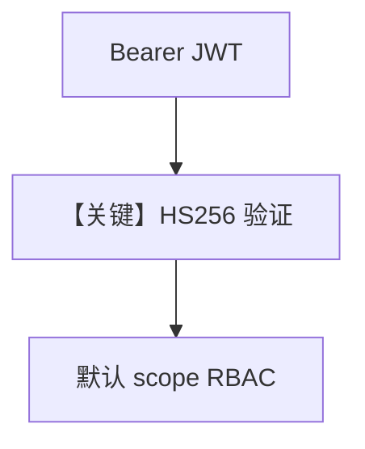

# basic.py — 实现原理分析

> 源文件：`cookbook/05_agent_os/rbac/symmetric/basic.py`

## 概述

本示例展示 **RBAC + HS256 对称密钥**：`AgentOS(authorization=True, authorization_config=AuthorizationConfig(verification_keys=[JWT_SECRET], algorithm="HS256"))`，依赖环境变量 `JWT_VERIFICATION_KEY`；端点默认映射如 `agents:read`、`agents:run`。

**核心配置一览：**

| 配置项 | 值 | 说明 |
|--------|------|------|
| `authorization` | `True` | 开启 |
| `JWT_SECRET` | env 或占位 | 验签 |

## Mermaid 流程图

## 关键源码文件索引

| 文件 | 关键函数/类 | 作用 |
|------|------------|------|
| `agno/os` | `AgentOS(authorization=...)` | 集成 |
