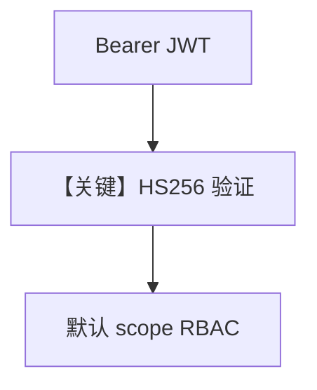

# basic.py — 实现原理分析

<!-- cookbook-py-source:start -->
## 完整源码

```python
"""
Basic RBAC Example with AgentOS

This example demonstrates how to enable RBAC (Role-Based Access Control)
with JWT token authentication in AgentOS using middleware.

Prerequisites:
- Set JWT_VERIFICATION_KEY environment variable or pass it to middleware
- Endpoints are automatically protected with default scope mappings
"""

import os
from datetime import UTC, datetime, timedelta

import jwt
from agno.agent import Agent
from agno.db.postgres import PostgresDb
from agno.models.openai import OpenAIChat
from agno.os import AgentOS
from agno.os.config import AuthorizationConfig
from agno.tools.websearch import WebSearchTools

# ---------------------------------------------------------------------------
# Create Example
# ---------------------------------------------------------------------------

# JWT Secret (use environment variable in production)
JWT_SECRET = os.getenv("JWT_VERIFICATION_KEY", "your-secret-key-at-least-256-bits-long")

# Setup database
db = PostgresDb(db_url="postgresql+psycopg://ai:ai@localhost:5532/ai")

# Create agents
research_agent = Agent(
    id="research-agent",
    name="Research Agent",
    model=OpenAIChat(id="gpt-4o"),
    db=db,
    tools=[WebSearchTools()],
    add_history_to_context=True,
    markdown=True,
)

# Create AgentOS
agent_os = AgentOS(
    id="my-agent-os",
    description="RBAC Protected AgentOS",
    agents=[research_agent],
    authorization=True,
    authorization_config=AuthorizationConfig(
        verification_keys=[JWT_SECRET],
        algorithm="HS256",
    ),
)

# Get the app and add RBAC middleware
app = agent_os.get_app()


# ---------------------------------------------------------------------------
# Run Example
# ---------------------------------------------------------------------------

if __name__ == "__main__":
    """
    Run your AgentOS with RBAC enabled.
    
    Audience Verification:
    - Tokens must include `aud` claim matching the AgentOS ID
    - Tokens with wrong audience will be rejected
    
    Default scope mappings protect all endpoints:
    - GET /agents/{agent_id}: requires "agents:read"
    - POST /agents/{agent_id}/runs: requires "agents:run"
    - GET /sessions: requires "sessions:read"
    - GET /memory: requires "memory:read"
    - etc.
    
    Scope format:
    - "agents:read" - List all agents
    - "agents:research-agent:run" - Run specific agent
    - "agents:*:run" - Run any agent
    - "agent_os:admin" - Full access to everything
    
    Test with a JWT token that includes scopes:
    """
    # Create test tokens with different scopes
    # Note: Include `aud` claim with AgentOS ID
    user_token_payload = {
        "sub": "user_123",
        "session_id": "session_456",
        "scopes": ["agents:read", "agents:run"],
        "exp": datetime.now(UTC) + timedelta(hours=24),
        "iat": datetime.now(UTC),
    }
    user_token = jwt.encode(user_token_payload, JWT_SECRET, algorithm="HS256")

    admin_token_payload = {
        "sub": "admin_789",
        "session_id": "admin_session_123",
        "scopes": ["agent_os:admin"],  # Admin has access to everything
        "exp": datetime.now(UTC) + timedelta(hours=24),
        "iat": datetime.now(UTC),
    }
    admin_token = jwt.encode(admin_token_payload, JWT_SECRET, algorithm="HS256")

    print("\n" + "=" * 60)
    print("RBAC Test Tokens")
    print("=" * 60)
    print("\nUser Token (agents:read, agents:run):")
    print(user_token)
    print("\nAdmin Token (agent_os:admin - full access):")
    print(admin_token)
    print("\n" + "=" * 60)
    print("\nTest commands:")
    print(
        '\ncurl -H "Authorization: Bearer '
        + user_token
        + '" http://localhost:7777/agents'
    )
    print(
        '\ncurl -H "Authorization: Bearer '
        + admin_token
        + '" http://localhost:7777/sessions'
    )
    print("\n" + "=" * 60 + "\n")

    agent_os.serve(app="basic:app", port=7777, reload=True)
```

<!-- cookbook-py-source:end -->

> 源文件：`cookbook/05_agent_os/rbac/symmetric/basic.py`

## 概述

本示例展示 **RBAC + HS256 对称密钥**：`AgentOS(authorization=True, authorization_config=AuthorizationConfig(verification_keys=[JWT_SECRET], algorithm="HS256"))`，依赖环境变量 `JWT_VERIFICATION_KEY`；端点默认映射如 `agents:read`、`agents:run`。

**核心配置一览：**

| 配置项 | 值 | 说明 |
|--------|------|------|
| `authorization` | `True` | 开启 |
| `JWT_SECRET` | env 或占位 | 验签 |

## Mermaid 流程图



## 关键源码文件索引

| 文件 | 关键函数/类 | 作用 |
|------|------------|------|
| `agno/os` | `AgentOS(authorization=...)` | 集成 |
