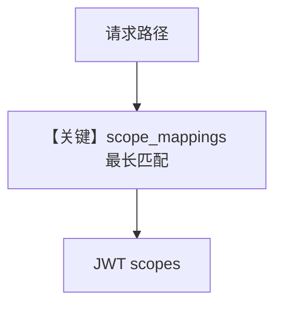

# custom_scope_mappings.py — 实现原理分析

> 源文件：`cookbook/05_agent_os/rbac/symmetric/custom_scope_mappings.py`

## 概述

本示例展示 **对称密钥 + `JWTMiddleware(scope_mappings=...)`**：在 **`app = agent_os.get_app()` 之后** `add_middleware`，自定义 `GET /agents` → `app:read` 等映射，并设 `admin_scope="agent_os:admin"` 绕过检查。

**核心配置一览：**

| 配置项 | 值 | 说明 |
|--------|------|------|
| `custom_scopes` | 见源文件 L46-57 | 路径级 |
| `JWTMiddleware` | `scope_mappings=custom_scopes` |  |

## Mermaid 流程图

## 关键源码文件索引

| 文件 | 关键函数/类 | 作用 |
|------|------------|------|
| `agno/os/middleware` | `JWTMiddleware` | RBAC |
