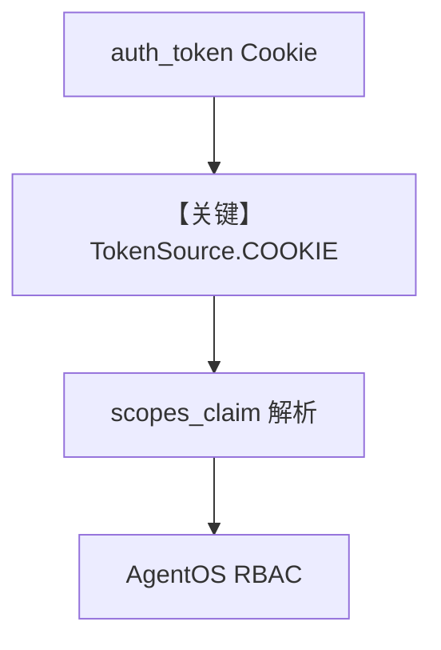

# with_cookie.py — 实现原理分析

> 源文件：`cookbook/05_agent_os/rbac/symmetric/with_cookie.py`

## 概述

本示例展示 **RBAC + Cookie JWT**：自建 `FastAPI` + `/set-auth-cookie`，再 **`JWTMiddleware(..., token_source=TokenSource.COOKIE, cookie_name="auth_token", scopes_claim="scopes")`**，最后 **`AgentOS(base_app=app)`** 合并 AgentOS 路由；排除 cookie 设置路径。

**核心配置一览：**

| 配置项 | 值 | 说明 |
|--------|------|------|
| `authorization` | `True`（在 middleware） |  |
| `excluded_route_paths` | `/set-auth-cookie` 等 | 免鉴权 |
| `AgentOS` | `id=my-agent-os` | audience |

## Mermaid 流程图

## 关键源码文件索引

| 文件 | 关键函数/类 | 作用 |
|------|------------|------|
| `agno/os/middleware` | `JWTMiddleware`, `TokenSource` | Cookie |
