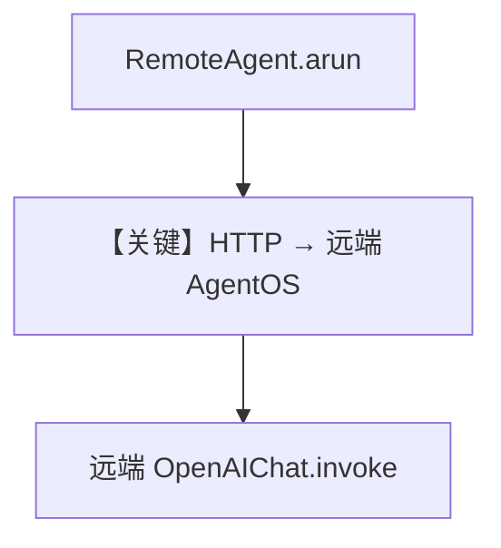

# 01_remote_agent.py — 实现原理分析

> 源文件：`cookbook/05_agent_os/remote/01_remote_agent.py`

## 概述

本示例展示 **`RemoteAgent` 客户端**：通过 `base_url` + `agent_id` 调用 **远端 AgentOS**（默认 `localhost:7778`）的 HTTP API，支持 `arun` 与 **流式** `stream=True, stream_events=True`，本地不实例化完整 Agent 图。

**核心配置一览：**

| 配置项 | 值 | 说明 |
|--------|------|------|
| `RemoteAgent` | `base_url`, `agent_id` | 远程引用 |
| 协议 | AgentOS HTTP（非 A2A） | 见 03 对比 |

## 运行机制与因果链

请求发往远端 `.../agents/{id}/runs`；需先启动 `server.py` 等。

## System Prompt 组装

无本地 Agent：system 在**远端**拼装；本节说明不适用 `get_system_message`（本地）。

## Mermaid 流程图

## 关键源码文件索引

| 文件 | 关键函数/类 | 作用 |
|------|------------|------|
| `agno/agent` | `RemoteAgent` | 远程客户端 |
