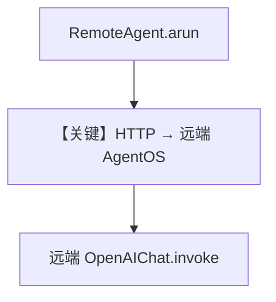

# 01_remote_agent.py — 实现原理分析

<!-- cookbook-py-source:start -->
## 完整源码

```python
"""
Examples demonstrating AgentOSRunner for remote execution.

Run `agent_os_setup.py` to start the remote AgentOS instance.
"""

import asyncio

from agno.agent import RemoteAgent

# ---------------------------------------------------------------------------
# Create Example
# ---------------------------------------------------------------------------


async def remote_agent_example():
    """Call a remote agent hosted on another AgentOS instance."""
    # Create a runner that points to a remote agent
    agent = RemoteAgent(
        base_url="http://localhost:7778",
        agent_id="assistant-agent",
    )

    response = await agent.arun(
        "What is the capital of France?",
        user_id="user-123",
        session_id="session-456",
    )
    print(response.content)


async def remote_streaming_example():
    """Stream responses from a remote agent."""
    runner = RemoteAgent(
        base_url="http://localhost:7778",
        agent_id="researcher-agent",
    )

    async for chunk in runner.arun(
        "Tell me a 2 sentence horror story",
        session_id="session-456",
        user_id="user-123",
        stream=True,
        stream_events=True,
    ):
        if hasattr(chunk, "content") and chunk.content:
            print(chunk.content, end="", flush=True)


async def main():
    """Run all examples in a single event loop."""
    print("=" * 60)
    print("RemoteAgent Examples")
    print("=" * 60)

    # Run examples
    # Note: Remote examples require a running AgentOS instance

    print("\n1. Remote Agent Example:")
    await remote_agent_example()

    print("\n2. Remote Streaming Example:")
    await remote_streaming_example()


# ---------------------------------------------------------------------------
# Run Example
# ---------------------------------------------------------------------------

if __name__ == "__main__":
    asyncio.run(main())
```

<!-- cookbook-py-source:end -->

> 源文件：`cookbook/05_agent_os/remote/01_remote_agent.py`

## 概述

本示例展示 **`RemoteAgent` 客户端**：通过 `base_url` + `agent_id` 调用 **远端 AgentOS**（默认 `localhost:7778`）的 HTTP API，支持 `arun` 与 **流式** `stream=True, stream_events=True`，本地不实例化完整 Agent 图。

**核心配置一览：**

| 配置项 | 值 | 说明 |
|--------|------|------|
| `RemoteAgent` | `base_url`, `agent_id` | 远程引用 |
| 协议 | AgentOS HTTP（非 A2A） | 见 03 对比 |

## 运行机制与因果链

请求发往远端 `.../agents/{id}/runs`；需先启动 `server.py` 等。

## System Prompt 组装

无本地 Agent：system 在**远端**拼装；本节说明不适用 `get_system_message`（本地）。

## Mermaid 流程图



## 关键源码文件索引

| 文件 | 关键函数/类 | 作用 |
|------|------------|------|
| `agno/agent` | `RemoteAgent` | 远程客户端 |
