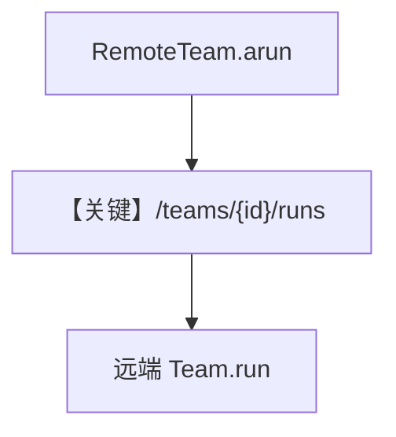

# 02_remote_team.py — 实现原理分析

> 源文件：`cookbook/05_agent_os/remote/02_remote_team.py`

## 概述

本示例展示 **`RemoteTeam`**：与 `RemoteAgent` 类似，使用 `team_id`（如 `research-team`）调用远端 Team 编排，支持流式输出。

**核心配置一览：**

| 配置项 | 值 | 说明 |
|--------|------|------|
| `RemoteTeam` | `base_url`, `team_id` | 远程 Team |

## System Prompt 组装

Team 级提示词在远端 `team/_messages`；本地仅 HTTP 客户端。

## Mermaid 流程图

## 关键源码文件索引

| 文件 | 关键函数/类 | 作用 |
|------|------------|------|
| `agno/team` | `RemoteTeam` | 客户端 |
