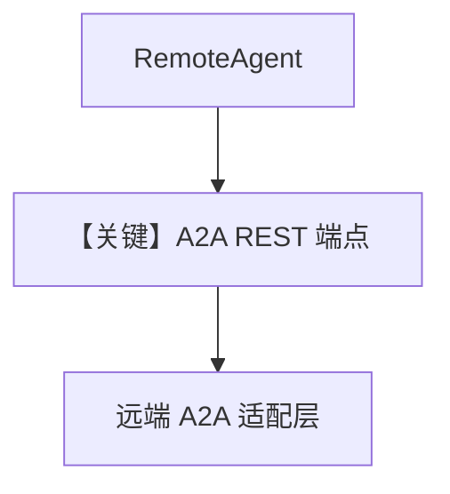

# 03_remote_agno_a2a_agent.py — 实现原理分析

<!-- cookbook-py-source:start -->
## 完整源码

```python
"""
Example demonstrating how to connect to a remote Agno A2A agent.

This example shows how to use RemoteAgent with the A2A protocol to connect
to an Agno agent that's exposed via the A2A interface.

Prerequisites:
1. Start an Agno A2A server:
   python cookbook/06_agent_os/remote/agno_a2a_server.py

   The server will run on http://localhost:7779

2. Set your OPENAI_API_KEY environment variable
"""

import asyncio

from agno.agent import RemoteAgent

# ---------------------------------------------------------------------------
# Create Example
# ---------------------------------------------------------------------------


async def remote_agno_a2a_agent_example():
    """Call a remote Agno agent exposed via A2A interface."""
    # Connect to remote Agno A2A agent
    # protocol="a2a" tells RemoteAgent to use A2A protocol
    # a2a_protocol="rest" uses REST API (default for Agno A2A servers)
    agent = RemoteAgent(
        base_url="http://localhost:7779/a2a/agents/assistant-agent-2",
        agent_id="assistant-agent-2",  # Agent ID from the A2A server
        protocol="a2a",
        a2a_protocol="rest",
    )

    print("Calling remote Agno A2A agent...")
    response = await agent.arun(
        "What is 15 * 23? Use the calculator tool.",
        user_id="user-123",
        session_id="session-456",
    )
    print(f"Response: {response.content}")


async def remote_agno_a2a_streaming_example():
    """Stream responses from a remote Agno A2A agent."""
    agent = RemoteAgent(
        base_url="http://localhost:7779/a2a/agents/researcher-agent-2",
        agent_id="researcher-agent-2",
        protocol="a2a",
        a2a_protocol="rest",
    )

    print("\nStreaming response from remote Agno A2A agent...")
    async for chunk in agent.arun(
        "Tell me a brief 2-sentence story about space exploration",
        session_id="session-456",
        user_id="user-123",
        stream=True,
        stream_events=True,
    ):
        if hasattr(chunk, "content") and chunk.content:
            print(chunk.content, end="", flush=True)
    print()  # New line after streaming


async def remote_agno_a2a_agent_info_example():
    """Get information about a remote Agno A2A agent."""
    agent = RemoteAgent(
        base_url="http://localhost:7779/a2a/agents/assistant-agent-2",
        agent_id="assistant-agent-2",
        protocol="a2a",
        a2a_protocol="rest",
    )

    print("\nGetting agent information...")
    config = await agent.get_agent_config()
    print(f"Agent ID: {config.id}")
    print(f"Agent Name: {config.name}")
    print(f"Agent Description: {config.description}")


async def main():
    """Run all examples in a single event loop."""
    print("=" * 60)
    print("Remote Agno A2A Agent Examples")
    print("=" * 60)
    print("\nNote: Make sure the Agno A2A server is running on port 7779")
    print("Start it with: python cookbook/06_agent_os/remote/agno_a2a_server.py\n")

    # Run examples
    print("1. Remote Agno A2A Agent Example:")
    await remote_agno_a2a_agent_example()

    print("\n2. Remote Agno A2A Streaming Example:")
    await remote_agno_a2a_streaming_example()

    print("\n3. Remote Agno A2A Agent Info Example:")
    await remote_agno_a2a_agent_info_example()


# ---------------------------------------------------------------------------
# Run Example
# ---------------------------------------------------------------------------

if __name__ == "__main__":
    asyncio.run(main())
```

<!-- cookbook-py-source:end -->

> 源文件：`cookbook/05_agent_os/remote/03_remote_agno_a2a_agent.py`

## 概述

本示例展示 **`RemoteAgent(protocol="a2a", a2a_protocol="rest")`**：连接 **Agno A2A 暴露的 URL**（如 `http://localhost:7779/a2a/agents/assistant-agent-2`），与 `01` 的纯 AgentOS REST 路径不同。

**核心配置一览：**

| 配置项 | 值 | 说明 |
|--------|------|------|
| `protocol` | `"a2a"` | A2A |
| `a2a_protocol` | `"rest"` | REST 变体 |

## 运行机制与因果链

需先起 `agno_a2a_server.py`（7779）。

## Mermaid 流程图



## 关键源码文件索引

| 文件 | 关键函数/类 | 作用 |
|------|------------|------|
| `agno/agent` | `RemoteAgent` | `protocol` 分支 |
