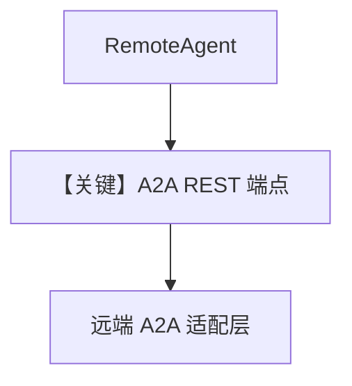

# 03_remote_agno_a2a_agent.py — 实现原理分析

> 源文件：`cookbook/05_agent_os/remote/03_remote_agno_a2a_agent.py`

## 概述

本示例展示 **`RemoteAgent(protocol="a2a", a2a_protocol="rest")`**：连接 **Agno A2A 暴露的 URL**（如 `http://localhost:7779/a2a/agents/assistant-agent-2`），与 `01` 的纯 AgentOS REST 路径不同。

**核心配置一览：**

| 配置项 | 值 | 说明 |
|--------|------|------|
| `protocol` | `"a2a"` | A2A |
| `a2a_protocol` | `"rest"` | REST 变体 |

## 运行机制与因果链

需先起 `agno_a2a_server.py`（7779）。

## Mermaid 流程图

## 关键源码文件索引

| 文件 | 关键函数/类 | 作用 |
|------|------------|------|
| `agno/agent` | `RemoteAgent` | `protocol` 分支 |
