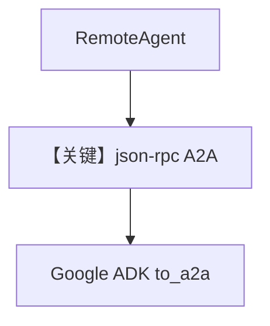

# 04_remote_adk_agent.py — 实现原理分析

> 源文件：`cookbook/05_agent_os/remote/04_remote_adk_agent.py`

## 概述

本示例展示 **连接 Google ADK A2A**：`RemoteAgent(protocol="a2a", a2a_protocol="json-rpc")`，`base_url` 指向 ADK 服务根（如 `localhost:7780`），与 Agno A2A REST 路径形态不同。

**核心配置一览：**

| 配置项 | 值 | 说明 |
|--------|------|------|
| `a2a_protocol` | `"json-rpc"` | ADK 根 `/` JSON-RPC |

## 前提

`adk_server.py` + `GOOGLE_API_KEY`。

## Mermaid 流程图

## 关键源码文件索引

| 文件 | 关键函数/类 | 作用 |
|------|------------|------|
| `agno/agent` | `RemoteAgent` | 协议选择 |
