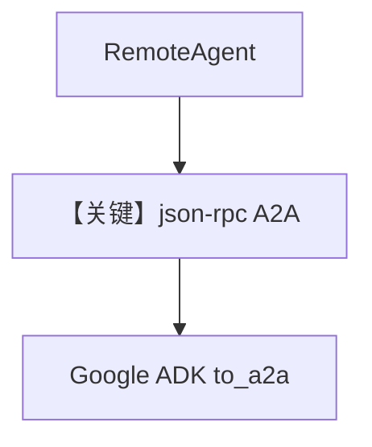

# 04_remote_adk_agent.py — 实现原理分析

<!-- cookbook-py-source:start -->
## 完整源码

```python
"""
Example demonstrating how to connect to a remote Google ADK agent.

This example shows how to use RemoteAgent with the A2A protocol to connect
to a Google ADK agent that's exposed via the A2A interface.

Prerequisites:
1. Start a Google ADK A2A server:
   python cookbook/06_agent_os/remote/adk_server.py

   The server will run on http://localhost:7780

2. Set your GOOGLE_API_KEY environment variable
"""

import asyncio

from agno.agent import RemoteAgent

# ---------------------------------------------------------------------------
# Create Example
# ---------------------------------------------------------------------------


async def remote_adk_agent_example():
    """Call a remote Google ADK agent exposed via A2A interface."""
    # Connect to remote Google ADK agent
    # protocol="a2a" tells RemoteAgent to use A2A protocol
    # a2a_protocol="json-rpc" uses JSON-RPC (Google ADK uses pure JSON-RPC at root "/")
    agent = RemoteAgent(
        base_url="http://localhost:7780",
        agent_id="facts_agent",  # Agent ID from the ADK server
        protocol="a2a",
        a2a_protocol="json-rpc",
    )

    print("Calling remote Google ADK agent...")
    response = await agent.arun(
        "Tell me an interesting fact about the solar system",
        user_id="user-123",
        session_id="session-456",
    )
    print(f"Response: {response.content}")


async def remote_adk_streaming_example():
    """Stream responses from a remote Google ADK agent."""
    agent = RemoteAgent(
        base_url="http://localhost:7780",
        agent_id="facts_agent",
        protocol="a2a",
        a2a_protocol="json-rpc",
    )

    print("\nStreaming response from remote Google ADK agent...")
    async for chunk in agent.arun(
        "Tell me three interesting facts about artificial intelligence",
        session_id="session-456",
        user_id="user-123",
        stream=True,
        stream_events=True,
    ):
        if hasattr(chunk, "content") and chunk.content:
            print(chunk.content, end="", flush=True)
    print()  # New line after streaming


async def remote_adk_agent_info_example():
    """Get information about a remote Google ADK agent."""
    agent = RemoteAgent(
        base_url="http://localhost:7780",
        agent_id="facts_agent",
        protocol="a2a",
        a2a_protocol="json-rpc",
    )

    print("\nGetting agent information...")
    config = await agent.get_agent_config()
    print(f"Agent ID: {config.id}")
    print(f"Agent Name: {config.name}")
    print(f"Agent Description: {config.description}")


async def main():
    """Run all examples in a single event loop."""
    print("=" * 60)
    print("Remote Google ADK Agent Examples")
    print("=" * 60)
    print("\nNote: Make sure the Google ADK A2A server is running on port 7780")
    print("Start it with: python cookbook/06_agent_os/remote/adk_server.py\n")

    # Run examples
    print("1. Remote Google ADK Agent Example:")
    await remote_adk_agent_example()

    print("\n2. Remote Google ADK Streaming Example:")
    await remote_adk_streaming_example()

    print("\n3. Remote Google ADK Agent Info Example:")
    await remote_adk_agent_info_example()


# ---------------------------------------------------------------------------
# Run Example
# ---------------------------------------------------------------------------

if __name__ == "__main__":
    asyncio.run(main())
```

<!-- cookbook-py-source:end -->

> 源文件：`cookbook/05_agent_os/remote/04_remote_adk_agent.py`

## 概述

本示例展示 **连接 Google ADK A2A**：`RemoteAgent(protocol="a2a", a2a_protocol="json-rpc")`，`base_url` 指向 ADK 服务根（如 `localhost:7780`），与 Agno A2A REST 路径形态不同。

**核心配置一览：**

| 配置项 | 值 | 说明 |
|--------|------|------|
| `a2a_protocol` | `"json-rpc"` | ADK 根 `/` JSON-RPC |

## 前提

`adk_server.py` + `GOOGLE_API_KEY`。

## Mermaid 流程图



## 关键源码文件索引

| 文件 | 关键函数/类 | 作用 |
|------|------------|------|
| `agno/agent` | `RemoteAgent` | 协议选择 |
