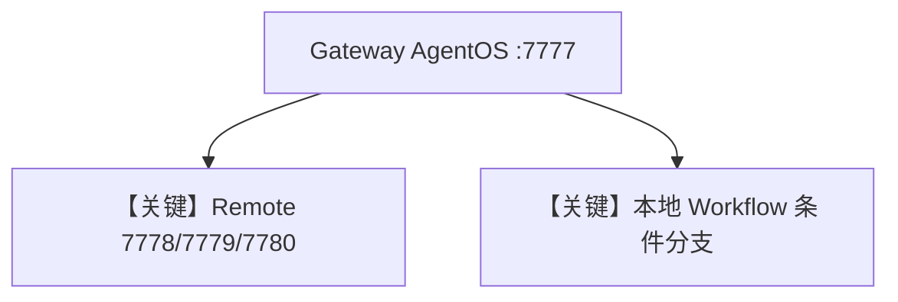

# 05_agent_os_gateway.py — 实现原理分析

<!-- cookbook-py-source:start -->
## 完整源码

```python
"""
Example showing how to use an AgentOS instance as a gateway to remote agents, teams and workflows.

This gateway demonstrates combining multiple remote agent sources:
1. AgentOS protocol agents (from server.py on port 7778)
2. Agno A2A protocol agents (from agno_a2a_server.py on port 7779)
3. Google ADK A2A protocol agents (from adk_server.py on port 7780)
4. Local agents and workflows

Prerequisites:
- Start server.py on port 7778
- Start agno_a2a_server.py on port 7779
- Start adk_server.py on port 7780 (requires GOOGLE_API_KEY)

# Note:
- Remote Workflows via Websocket are not yet supported
- If authorization is enabled on remote servers and all endpoints are protected, not all of the functions work correctly on the gateway. Specifically /config, /workflows, /workflows/{workflow_id}, /agents, /teams, /agent/{agent_id}, /team/{team_id} need to be unprotected for the gateway to work correctly.
"""

from agno.agent import Agent, RemoteAgent
from agno.db.postgres import PostgresDb
from agno.models.openai import OpenAIChat
from agno.os import AgentOS
from agno.team import RemoteTeam
from agno.workflow import RemoteWorkflow, Workflow
from agno.workflow.agent import WorkflowAgent
from agno.workflow.condition import Condition
from agno.workflow.step import Step
from agno.workflow.types import StepInput

# ---------------------------------------------------------------------------
# Create Example
# ---------------------------------------------------------------------------

# Setup the database
db = PostgresDb(id="basic-db", db_url="postgresql+psycopg://ai:ai@localhost:5532/ai")

# === SETUP ADVANCED WORKFLOW ===
story_writer = Agent(
    name="Story Writer",
    model=OpenAIChat(id="gpt-5.2"),
    instructions="You are tasked with writing a 100 word story based on a given topic",
)

story_editor = Agent(
    name="Story Editor",
    model=OpenAIChat(id="gpt-5.2"),
    instructions="Review and improve the story's grammar, flow, and clarity",
)

story_formatter = Agent(
    name="Story Formatter",
    model=OpenAIChat(id="gpt-5.2"),
    instructions="Break down the story into prologue, body, and epilogue sections",
)


def needs_editing(step_input: StepInput) -> bool:
    """Determine if the story needs editing based on length and complexity"""
    story = step_input.previous_step_content or ""

    # Check if story is long enough to benefit from editing
    word_count = len(story.split())

    # Edit if story is more than 50 words or contains complex punctuation
    return word_count > 50 or any(punct in story for punct in ["!", "?", ";", ":"])


def add_references(step_input: StepInput):
    """Add references to the story"""
    previous_output = step_input.previous_step_content

    if isinstance(previous_output, str):
        return previous_output + "\n\nReferences: https://www.agno.com"


write_step = Step(
    name="write_story",
    description="Write initial story",
    agent=story_writer,
)

edit_step = Step(
    name="edit_story",
    description="Edit and improve the story",
    agent=story_editor,
)

format_step = Step(
    name="format_story",
    description="Format the story into sections",
    agent=story_formatter,
)

# Create a WorkflowAgent that will decide when to run the workflow
workflow_agent = WorkflowAgent(model=OpenAIChat(id="gpt-5.2"), num_history_runs=4)

advanced_workflow = Workflow(
    name="Story Generation with Conditional Editing",
    description="A workflow that generates stories, conditionally edits them, formats them, and adds references",
    agent=workflow_agent,
    steps=[
        write_step,
        Condition(
            name="editing_condition",
            description="Check if story needs editing",
            evaluator=needs_editing,
            steps=[edit_step],
        ),
        format_step,
        add_references,
    ],
    db=db,
)

# Setup our AgentOS app
agent_os = AgentOS(
    description="Gateway combining AgentOS, Agno A2A, and Google ADK agents",
    agents=[
        # AgentOS protocol agents (from server.py on port 7778)
        RemoteAgent(base_url="http://localhost:7778", agent_id="assistant-agent"),
        RemoteAgent(base_url="http://localhost:7778", agent_id="researcher-agent"),
        # Agno A2A protocol agents (from agno_a2a_server.py on port 7779)
        RemoteAgent(
            base_url="http://localhost:7779/a2a/agents/assistant-agent-2",
            agent_id="assistant-agent-2",
            protocol="a2a",
            a2a_protocol="rest",
        ),
        RemoteAgent(
            base_url="http://localhost:7779/a2a/agents/researcher-agent-2",
            agent_id="researcher-agent-2",
            protocol="a2a",
            a2a_protocol="rest",
        ),
        # Google ADK A2A protocol agent (from adk_server.py on port 7780)
        RemoteAgent(
            base_url="http://localhost:7780",
            agent_id="facts_agent",
            protocol="a2a",
            a2a_protocol="json-rpc",
        ),
        # Local agents
        story_writer,
        story_editor,
        story_formatter,
    ],
    teams=[RemoteTeam(base_url="http://localhost:7778", team_id="research-team")],
    workflows=[
        RemoteWorkflow(base_url="http://localhost:7778", workflow_id="qa-workflow"),
        advanced_workflow,
    ],
)
app = agent_os.get_app()


# ---------------------------------------------------------------------------
# Run Example
# ---------------------------------------------------------------------------

if __name__ == "__main__":
    """
    Run your AgentOS gateway.
    
    This gateway combines:
    - Remote AgentOS agents (port 7778)
    - Remote Agno A2A agents (port 7779)
    - Remote Google ADK agents (port 7780)
    - Local agents and workflows
    
    All accessible via a single API on port 7777.
    """
    agent_os.serve(app="05_agent_os_gateway:app", reload=True, port=7777)
```

<!-- cookbook-py-source:end -->

> 源文件：`cookbook/05_agent_os/remote/05_agent_os_gateway.py`

## 概述

本示例展示 **统一网关 AgentOS**：在同一 `AgentOS` 中并列注册 **`RemoteAgent`/`RemoteTeam`/`RemoteWorkflow`**（分别指向 7778 AgentOS、7779 Agno A2A、7780 ADK）与 **本地 Agent + 条件 Workflow**（`Condition`、`WorkflowAgent`），对外单一端口 **7777**。

**核心配置一览：**

| 配置项 | 值 | 说明 |
|--------|------|------|
| 远程 | 多种 `RemoteAgent`/`RemoteTeam`/`RemoteWorkflow` | 多源 |
| 本地 | `advanced_workflow` + 三 Agent | 故事流水线 |

## 运行机制与因果链

网关将请求路由到对应 **本地或远程** 实体；远程需三服务先启动。

## System Prompt 组装

各实体独立；本地 story agents 含短 `instructions`（见源文件 L39-54）。

## Mermaid 流程图



## 关键源码文件索引

| 文件 | 关键函数/类 | 作用 |
|------|------------|------|
| `agno/agent` | `RemoteAgent` | 聚合 |
| `agno/workflow` | `Condition`, `WorkflowAgent` | 本地流 |
