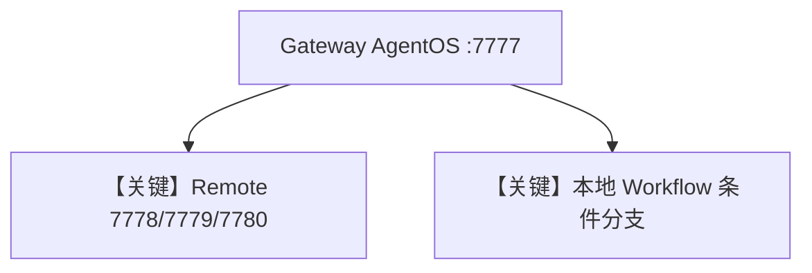

# 05_agent_os_gateway.py — 实现原理分析

> 源文件：`cookbook/05_agent_os/remote/05_agent_os_gateway.py`

## 概述

本示例展示 **统一网关 AgentOS**：在同一 `AgentOS` 中并列注册 **`RemoteAgent`/`RemoteTeam`/`RemoteWorkflow`**（分别指向 7778 AgentOS、7779 Agno A2A、7780 ADK）与 **本地 Agent + 条件 Workflow**（`Condition`、`WorkflowAgent`），对外单一端口 **7777**。

**核心配置一览：**

| 配置项 | 值 | 说明 |
|--------|------|------|
| 远程 | 多种 `RemoteAgent`/`RemoteTeam`/`RemoteWorkflow` | 多源 |
| 本地 | `advanced_workflow` + 三 Agent | 故事流水线 |

## 运行机制与因果链

网关将请求路由到对应 **本地或远程** 实体；远程需三服务先启动。

## System Prompt 组装

各实体独立；本地 story agents 含短 `instructions`（见源文件 L39-54）。

## Mermaid 流程图

## 关键源码文件索引

| 文件 | 关键函数/类 | 作用 |
|------|------------|------|
| `agno/agent` | `RemoteAgent` | 聚合 |
| `agno/workflow` | `Condition`, `WorkflowAgent` | 本地流 |
