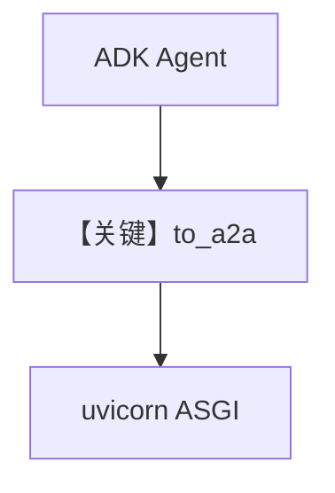

# adk_server.py — 实现原理分析

<!-- cookbook-py-source:start -->
## 完整源码

```python
"""
Google ADK A2A Server for Cookbook Examples.

Uses Google's ADK to create an A2A-compatible agent.
Requires GOOGLE_API_KEY environment variable.

This server exposes a facts-agent that provides interesting facts,
using pure JSON-RPC at root "/" endpoint (Google ADK style).

Start this server before running 05_remote_adk_agent.py
"""

import os

from a2a.types import AgentCapabilities, AgentCard
from google.adk import Agent
from google.adk.a2a.utils.agent_to_a2a import to_a2a
from google.adk.tools import google_search

# ---------------------------------------------------------------------------
# Create Example
# ---------------------------------------------------------------------------

port = int(os.getenv("PORT", "7780"))

agent = Agent(
    name="facts_agent",
    model="gemini-2.5-flash-lite",
    description="Agent that provides interesting facts.",
    instruction="You are a helpful agent who provides interesting facts.",
    tools=[google_search],
)

# Define A2A agent card
agent_card = AgentCard(
    name="facts_agent",
    description="Agent that provides interesting facts.",
    url=f"http://localhost:{port}",
    version="1.0.0",
    capabilities=AgentCapabilities(
        streaming=True, push_notifications=False, state_transition_history=False
    ),
    skills=[],
    default_input_modes=["text/plain"],
    default_output_modes=["text/plain"],
)

app = to_a2a(agent, port=port, agent_card=agent_card)

# ---------------------------------------------------------------------------
# Run Example
# ---------------------------------------------------------------------------

if __name__ == "__main__":
    import uvicorn

    uvicorn.run(app, host="0.0.0.0", port=port)
```

<!-- cookbook-py-source:end -->

> 源文件：`cookbook/05_agent_os/remote/adk_server.py`

## 概述

本示例为 **Google ADK + A2A**：`google.adk.Agent` + `google_search` 工具，`to_a2a(agent, port=..., agent_card=...)` 生成 ASGI 应用，**JSON-RPC 在根 `/`**，供 `04_remote_adk_agent.py` 连接。

**核心配置一览：**

| 配置项 | 值 | 说明 |
|--------|------|------|
| `model` | `gemini-2.5-flash-lite` | Google |
| `AgentCard` | url/capabilities | A2A 元数据 |

## System Prompt 组装

非 Agno Agent：由 ADK `instruction` 字段定义。

## Mermaid 流程图



## 关键源码文件索引

| 文件 | 关键函数/类 | 作用 |
|------|------------|------|
| `google.adk.a2a` | `to_a2a` | A2A 包装 |
