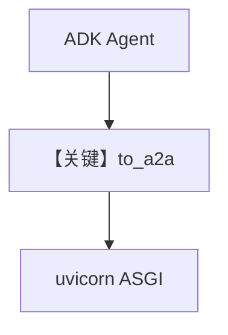

# adk_server.py — 实现原理分析

> 源文件：`cookbook/05_agent_os/remote/adk_server.py`

## 概述

本示例为 **Google ADK + A2A**：`google.adk.Agent` + `google_search` 工具，`to_a2a(agent, port=..., agent_card=...)` 生成 ASGI 应用，**JSON-RPC 在根 `/`**，供 `04_remote_adk_agent.py` 连接。

**核心配置一览：**

| 配置项 | 值 | 说明 |
|--------|------|------|
| `model` | `gemini-2.5-flash-lite` | Google |
| `AgentCard` | url/capabilities | A2A 元数据 |

## System Prompt 组装

非 Agno Agent：由 ADK `instruction` 字段定义。

## Mermaid 流程图

## 关键源码文件索引

| 文件 | 关键函数/类 | 作用 |
|------|------------|------|
| `google.adk.a2a` | `to_a2a` | A2A 包装 |
