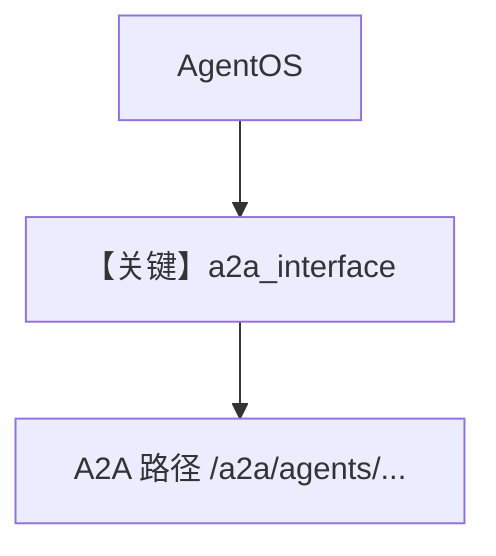

# agno_a2a_server.py — 实现原理分析

<!-- cookbook-py-source:start -->
## 完整源码

```python
"""
Agno A2A Server for Cookbook Examples.

This server exposes Agno agents via the A2A (Agent-to-Agent) interface,
allowing them to be accessed by any A2A-compatible client.

Start this server before running 04_remote_agno_a2a_agent.py
"""

from agno.agent import Agent
from agno.db.sqlite import SqliteDb
from agno.knowledge.embedder.openai import OpenAIEmbedder
from agno.knowledge.knowledge import Knowledge
from agno.models.openai import OpenAIChat
from agno.os import AgentOS
from agno.tools.calculator import CalculatorTools
from agno.tools.websearch import WebSearchTools
from agno.vectordb.chroma import ChromaDb

# ---------------------------------------------------------------------------
# Create Example
# ---------------------------------------------------------------------------

# =============================================================================
# Database Configuration
# =============================================================================

db = SqliteDb(id="cookbook-a2a-db", db_file="tmp/cookbook_a2a.db")

# =============================================================================
# Knowledge Base Configuration
# =============================================================================

knowledge = Knowledge(
    vector_db=ChromaDb(
        path="tmp/cookbook_a2a_chromadb",
        collection="cookbook_a2a_knowledge",
        embedder=OpenAIEmbedder(id="text-embedding-3-small"),
    ),
    contents_db=db,
)

# =============================================================================
# Agent Configuration
# =============================================================================

# Agent 1: Assistant with calculator tools and knowledge base
assistant = Agent(
    name="Assistant",
    id="assistant-agent-2",
    description="A helpful AI assistant with calculator capabilities.",
    model=OpenAIChat(id="gpt-5.2"),
    db=db,
    instructions=[
        "You are a helpful AI assistant.",
        "Use the calculator tool for any math operations.",
        "You have access to a knowledge base - search it when asked about documents.",
    ],
    markdown=True,
    tools=[CalculatorTools()],
    knowledge=knowledge,
    search_knowledge=True,
)

# Agent 2: Researcher with web search capabilities
researcher = Agent(
    name="Researcher",
    id="researcher-agent-2",
    description="A research assistant with web search capabilities.",
    model=OpenAIChat(id="gpt-5.2"),
    db=db,
    instructions=[
        "You are a research assistant.",
        "Search the web for information when needed.",
        "Provide well-researched, accurate responses.",
    ],
    markdown=True,
    tools=[WebSearchTools()],
)

# =============================================================================
# AgentOS Configuration with A2A Interface
# =============================================================================

agent_os = AgentOS(
    id="cookbook-a2a-server",
    description="Agno A2A server for cookbook examples",
    agents=[assistant, researcher],
    knowledge=[knowledge],
    a2a_interface=True,  # Enable A2A interface
)

# FastAPI app instance (for uvicorn)
app = agent_os.get_app()

# =============================================================================
# Main Entry Point
# =============================================================================

# ---------------------------------------------------------------------------
# Run Example
# ---------------------------------------------------------------------------

if __name__ == "__main__":
    agent_os.serve(app="agno_a2a_server:app", reload=True, access_log=True, port=7779)
```

<!-- cookbook-py-source:end -->

> 源文件：`cookbook/05_agent_os/remote/agno_a2a_server.py`

## 概述

本示例展示 **AgentOS + `a2a_interface=True`**：注册 `assistant`（计算器+知识库）与 `researcher`（联网），Chroma + `Knowledge`，端口 **7779**，供 A2A 客户端与 `03_remote_agno_a2a_agent.py` 使用。

**核心配置一览：**

| 配置项 | 值 | 说明 |
|--------|------|------|
| `a2a_interface` | `True` | A2A |
| `knowledge` | `ChromaDb` + `OpenAIEmbedder` | RAG |

## System Prompt 组装

各 Agent 见源文件 `instructions`；`search_knowledge=True` 时含检索工具链。

## Mermaid 流程图



## 关键源码文件索引

| 文件 | 关键函数/类 | 作用 |
|------|------------|------|
| `agno/os` | `AgentOS(a2a_interface=...)` | A2A |
