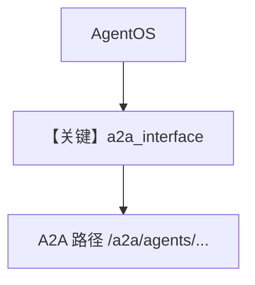

# agno_a2a_server.py — 实现原理分析

> 源文件：`cookbook/05_agent_os/remote/agno_a2a_server.py`

## 概述

本示例展示 **AgentOS + `a2a_interface=True`**：注册 `assistant`（计算器+知识库）与 `researcher`（联网），Chroma + `Knowledge`，端口 **7779**，供 A2A 客户端与 `03_remote_agno_a2a_agent.py` 使用。

**核心配置一览：**

| 配置项 | 值 | 说明 |
|--------|------|------|
| `a2a_interface` | `True` | A2A |
| `knowledge` | `ChromaDb` + `OpenAIEmbedder` | RAG |

## System Prompt 组装

各 Agent 见源文件 `instructions`；`search_knowledge=True` 时含检索工具链。

## Mermaid 流程图

## 关键源码文件索引

| 文件 | 关键函数/类 | 作用 |
|------|------------|------|
| `agno/os` | `AgentOS(a2a_interface=...)` | A2A |
