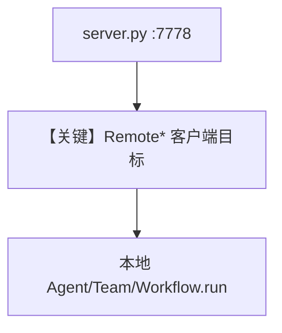

# server.py — 实现原理分析

> 源文件：`cookbook/05_agent_os/remote/server.py`

## 概述

本示例为 **远端 AgentOS 样板（7778）**：`assistant`、`researcher`、`research-team`、`qa-workflow`，Chroma 知识库；**无** `a2a_interface`，供 `RemoteAgent`/`RemoteTeam`/`RemoteWorkflow` 走 **标准 AgentOS HTTP**。

**核心配置一览：**

| 配置项 | 值 | 说明 |
|--------|------|------|
| `agent_os` | `id=cookbook-client-server` |  |
| 实体 | agents + teams + workflows + knowledge | 全类型 |

## System Prompt 组装

Team `instructions` 见 L89-94；各 Agent 见 L53-77。

## Mermaid 流程图

## 关键源码文件索引

| 文件 | 关键函数/类 | 作用 |
|------|------------|------|
| `agno/os` | `AgentOS` | 服务 |
