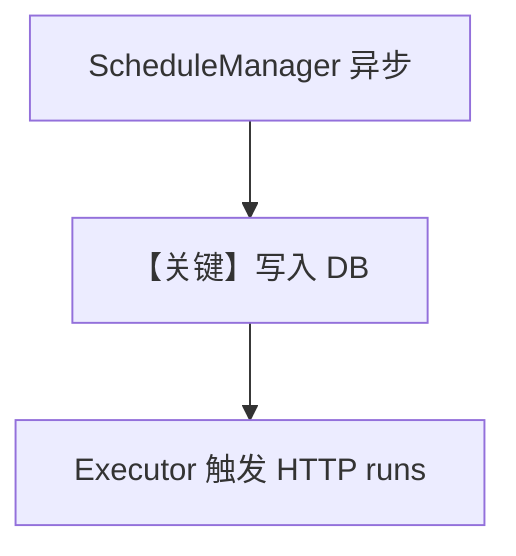

# async_schedule.py — 实现原理分析

> 源文件：`cookbook/05_agent_os/scheduler/async_schedule.py`

## 概述

本示例展示 **`ScheduleManager` 异步 API**：`acreate` / `alist` / `aget` / `aupdate` / `adelete` / `aenable` / `adisable` / `aget_runs`，配合 `SchedulerConsole` 展示，用于在 **asyncio** 环境管理定时任务元数据（endpoint 指向 AgentOS `/agents/.../runs`）。

**核心配置一览：**

| 配置项 | 值 | 说明 |
|--------|------|------|
| `mgr` | `ScheduleManager(db)` | 异步 CRUD |
| `cron` | 如 `0 8 * * *` | 触发时间 |

## System Prompt 组装

本文件无 Agent：仅调度 **元数据**；实际 LLM 在 endpoint 指向的 agent run 中。

## Mermaid 流程图

## 关键源码文件索引

| 文件 | 关键函数/类 | 作用 |
|------|------------|------|
| `agno/scheduler` | `ScheduleManager` | 异步 API |
