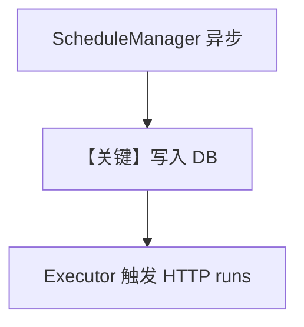

# async_schedule.py — 实现原理分析

<!-- cookbook-py-source:start -->
## 完整源码

```python
"""Async schedule management using the async ScheduleManager API.

This example demonstrates:
- Using acreate(), alist(), aget(), aupdate(), adelete() for async CRUD
- Using aenable() and adisable() to toggle schedules
- Using aget_runs() to list run history
- Rich-formatted display with SchedulerConsole
"""

import asyncio

from agno.db.sqlite import SqliteDb
from agno.scheduler import ScheduleManager
from agno.scheduler.cli import SchedulerConsole


async def main():
    # --- Setup ---
    db = SqliteDb(id="async-scheduler-demo", db_file="tmp/async_scheduler_demo.db")
    mgr = ScheduleManager(db)
    console = SchedulerConsole(mgr)

    # --- Create schedules asynchronously ---
    s1 = await mgr.acreate(
        name="async-morning-report",
        cron="0 8 * * *",
        endpoint="/agents/async-agent/runs",
        description="Morning report via async API",
        payload={"message": "Generate the morning report"},
    )
    print(f"Created: {s1.name} (id={s1.id})")

    s2 = await mgr.acreate(
        name="async-evening-summary",
        cron="0 18 * * *",
        endpoint="/agents/async-agent/runs",
        description="Evening summary via async API",
        payload={"message": "Summarize the day"},
    )
    print(f"Created: {s2.name} (id={s2.id})")

    # --- List all schedules ---
    all_schedules = await mgr.alist()
    print(f"\nTotal schedules: {len(all_schedules)}")

    # --- Get by ID ---
    fetched = await mgr.aget(s1.id)
    print(f"Fetched: {fetched.name}")

    # --- Update ---
    updated = await mgr.aupdate(s1.id, description="Updated morning report description")
    print(f"Updated description: {updated.description}")

    # --- Disable and re-enable ---
    await mgr.adisable(s2.id)
    disabled = await mgr.aget(s2.id)
    print(f"\n{disabled.name} enabled={disabled.enabled}")

    await mgr.aenable(s2.id)
    enabled = await mgr.aget(s2.id)
    print(f"{enabled.name} enabled={enabled.enabled}")

    # --- Check runs (none yet, since we haven't executed) ---
    runs = await mgr.aget_runs(s1.id)
    print(f"\nRuns for {s1.name}: {len(runs)}")

    # --- Display with Rich ---
    print()
    console.show_schedules()

    # --- Cleanup ---
    await mgr.adelete(s1.id)
    await mgr.adelete(s2.id)
    print("\nAll schedules deleted.")


if __name__ == "__main__":
    asyncio.run(main())
```

<!-- cookbook-py-source:end -->

> 源文件：`cookbook/05_agent_os/scheduler/async_schedule.py`

## 概述

本示例展示 **`ScheduleManager` 异步 API**：`acreate` / `alist` / `aget` / `aupdate` / `adelete` / `aenable` / `adisable` / `aget_runs`，配合 `SchedulerConsole` 展示，用于在 **asyncio** 环境管理定时任务元数据（endpoint 指向 AgentOS `/agents/.../runs`）。

**核心配置一览：**

| 配置项 | 值 | 说明 |
|--------|------|------|
| `mgr` | `ScheduleManager(db)` | 异步 CRUD |
| `cron` | 如 `0 8 * * *` | 触发时间 |

## System Prompt 组装

本文件无 Agent：仅调度 **元数据**；实际 LLM 在 endpoint 指向的 agent run 中。

## Mermaid 流程图



## 关键源码文件索引

| 文件 | 关键函数/类 | 作用 |
|------|------------|------|
| `agno/scheduler` | `ScheduleManager` | 异步 API |
