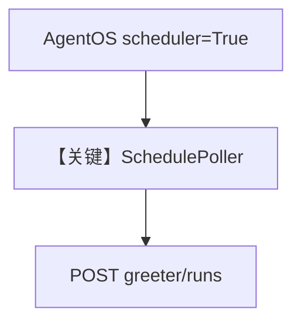

# basic_schedule.py — 实现原理分析

<!-- cookbook-py-source:start -->
## 完整源码

```python
"""Basic scheduled agent run.

Starts an AgentOS with the scheduler enabled. After the server is running,
use the REST API to create a schedule that triggers an agent every 5 minutes.

Prerequisites:
    pip install agno[scheduler]
    # Start postgres: ./cookbook/scripts/run_pgvector.sh

Usage:
    python cookbook/05_agent_os/scheduler/basic_schedule.py

Then, in another terminal, create a schedule:
    curl -X POST http://localhost:7777/schedules \
        -H "Content-Type: application/json" \
        -d '{
            "name": "greeting-every-5m",
            "cron_expr": "*/5 * * * *",
            "endpoint": "/agents/greeter/runs",
            "payload": {"message": "Say hello!"}
        }'
"""

from agno.agent import Agent
from agno.db.postgres import PostgresDb
from agno.models.openai import OpenAIChat
from agno.os import AgentOS

# ---------------------------------------------------------------------------
# Create Example
# ---------------------------------------------------------------------------

db = PostgresDb(
    id="scheduler-demo-db",
    db_url="postgresql+psycopg://ai:ai@localhost:5532/ai",
)

greeter = Agent(
    id="greeter",
    name="Greeter Agent",
    model=OpenAIChat(id="gpt-4o-mini"),
    instructions=[
        "You are a friendly greeter. Say hello and include the current time."
    ],
    db=db,
    markdown=True,
)

app = AgentOS(
    agents=[greeter],
    db=db,
    scheduler=True,
    scheduler_poll_interval=15,
).get_app()

# ---------------------------------------------------------------------------
# Run Example
# ---------------------------------------------------------------------------

if __name__ == "__main__":
    import uvicorn

    uvicorn.run(app, host="0.0.0.0", port=7777)
```

<!-- cookbook-py-source:end -->

> 源文件：`cookbook/05_agent_os/scheduler/basic_schedule.py`

## 概述

本示例展示 **`AgentOS(..., scheduler=True, scheduler_poll_interval=15)` + Postgres**：注册 `greeter` Agent，启动后通过 **curl POST `/schedules`** 创建 cron，触发 `/agents/greeter/runs`。

**核心配置一览：**

| 配置项 | 值 | 说明 |
|--------|------|------|
| `scheduler` | `True` | 启用轮询 |
| `db` | `PostgresDb` | 生产向 |

## Mermaid 流程图



## 关键源码文件索引

| 文件 | 关键函数/类 | 作用 |
|------|------------|------|
| `agno/os/app.py` | `scheduler` | 集成 |
