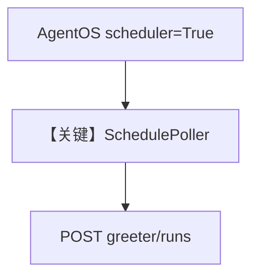

# basic_schedule.py — 实现原理分析

> 源文件：`cookbook/05_agent_os/scheduler/basic_schedule.py`

## 概述

本示例展示 **`AgentOS(..., scheduler=True, scheduler_poll_interval=15)` + Postgres**：注册 `greeter` Agent，启动后通过 **curl POST `/schedules`** 创建 cron，触发 `/agents/greeter/runs`。

**核心配置一览：**

| 配置项 | 值 | 说明 |
|--------|------|------|
| `scheduler` | `True` | 启用轮询 |
| `db` | `PostgresDb` | 生产向 |

## Mermaid 流程图

## 关键源码文件索引

| 文件 | 关键函数/类 | 作用 |
|------|------------|------|
| `agno/os/app.py` | `scheduler` | 集成 |
