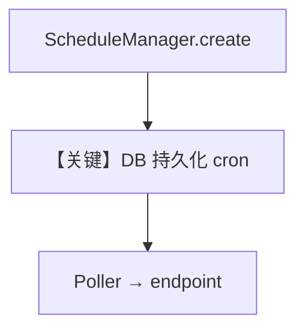

# demo.py — 实现原理分析

> 源文件：`cookbook/05_agent_os/scheduler/demo.py`

## 概述

本示例展示 **`ScheduleManager.create` 程序化建表** + **`AgentOS(scheduler=True)`**：无需 curl，启动 OS 时用 `mgr.create` 指向 `/agents/greeter/runs` 等；poller 周期触发。

**核心配置一览：**

| 配置项 | 值 | 说明 |
|--------|------|------|
| `mgr.create` | `cron`, `endpoint`, `payload` | 同步 API |
| `if_exists` | `"update"` | 幂等 |

## Mermaid 流程图

## 关键源码文件索引

| 文件 | 关键函数/类 | 作用 |
|------|------------|------|
| `agno/scheduler` | `ScheduleManager` | CRUD |
