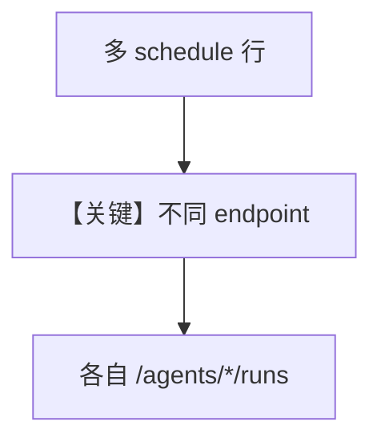

# multi_agent_schedules.py — 实现原理分析

> 源文件：`cookbook/05_agent_os/scheduler/multi_agent_schedules.py`

## 概述

本示例展示 **多 Agent 多 cron/时区/重试**：`ScheduleManager.create` 为 research/writer/monitor 配置不同 `endpoint`、`timezone`、`max_retries`，并用 `SchedulerConsole` 表格展示与过滤。

**核心配置一览：**

| 配置项 | 值 | 说明 |
|--------|------|------|
| `timezone` | 如 `America/New_York` | 本地化触发 |
| `payload` | JSON | 每任务定制 |

## Mermaid 流程图

## 关键源码文件索引

| 文件 | 关键函数/类 | 作用 |
|------|------------|------|
| `agno/scheduler/cli` | `SchedulerConsole` | 展示 |
