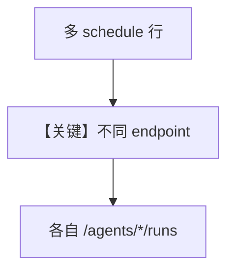

# multi_agent_schedules.py — 实现原理分析

<!-- cookbook-py-source:start -->
## 完整源码

```python
"""Multi-agent scheduling with different cron patterns and payloads.

This example demonstrates:
- Multiple agents with different roles
- Each agent gets a schedule with different cron, timezone, payload
- Retry configuration for reliability
- Rich table showing all schedules
- Filtered views (enabled only, disabled only)
"""

from agno.db.sqlite import SqliteDb
from agno.scheduler import ScheduleManager
from agno.scheduler.cli import SchedulerConsole

# --- Setup ---

db = SqliteDb(id="multi-agent-demo", db_file="tmp/multi_agent_demo.db")
mgr = ScheduleManager(db)
console = SchedulerConsole(mgr)

# =============================================================================
# Create schedules with different configurations
# =============================================================================

print("Creating schedules for 3 agents...\n")

# Research agent: daily at 7 AM EST with custom payload
s_research = mgr.create(
    name="daily-research",
    cron="0 7 * * *",
    endpoint="/agents/research-agent/runs",
    description="Gather daily research insights",
    timezone="America/New_York",
    payload={
        "message": "Research the latest AI developments",
        "stream": False,
    },
)

# Writer agent: weekdays at 10 AM UTC
s_writer = mgr.create(
    name="weekday-report",
    cron="0 10 * * 1-5",
    endpoint="/agents/writer-agent/runs",
    description="Generate weekday summary report",
    payload={
        "message": "Write a summary of yesterday's research",
    },
)

# Monitor agent: every 15 minutes with retry configuration
s_monitor = mgr.create(
    name="health-monitor",
    cron="*/15 * * * *",
    endpoint="/agents/monitor-agent/runs",
    description="System health check every 15 minutes",
    payload={
        "message": "Check system health and report anomalies",
    },
    max_retries=3,
    retry_delay_seconds=30,
    timeout_seconds=120,
)

print("All schedules created.")

# =============================================================================
# Display all schedules
# =============================================================================

print("\n--- All Schedules ---")
console.show_schedules()

# =============================================================================
# Show individual schedule details
# =============================================================================

print("\n--- Monitor Schedule Details ---")
console.show_schedule(s_monitor.id)

# =============================================================================
# Disable one schedule and show filtered views
# =============================================================================

mgr.disable(s_writer.id)
print("\nDisabled 'weekday-report' schedule.")

print("\n--- Enabled Schedules Only ---")
enabled = console.show_schedules(enabled=True)
print(f"({len(enabled)} enabled)")

print("\n--- Disabled Schedules Only ---")
disabled = console.show_schedules(enabled=False)
print(f"({len(disabled)} disabled)")

# =============================================================================
# Re-enable and verify
# =============================================================================

mgr.enable(s_writer.id)
print("\nRe-enabled 'weekday-report' schedule.")

all_schedules = mgr.list()
print(f"Total schedules: {len(all_schedules)}")

# =============================================================================
# Cleanup
# =============================================================================

# Uncomment to clean up schedules from the DB:
# for s in [s_research, s_writer, s_monitor]:
#     mgr.delete(s.id)
# print("\nAll schedules cleaned up.")
```

<!-- cookbook-py-source:end -->

> 源文件：`cookbook/05_agent_os/scheduler/multi_agent_schedules.py`

## 概述

本示例展示 **多 Agent 多 cron/时区/重试**：`ScheduleManager.create` 为 research/writer/monitor 配置不同 `endpoint`、`timezone`、`max_retries`，并用 `SchedulerConsole` 表格展示与过滤。

**核心配置一览：**

| 配置项 | 值 | 说明 |
|--------|------|------|
| `timezone` | 如 `America/New_York` | 本地化触发 |
| `payload` | JSON | 每任务定制 |

## Mermaid 流程图



## 关键源码文件索引

| 文件 | 关键函数/类 | 作用 |
|------|------------|------|
| `agno/scheduler/cli` | `SchedulerConsole` | 展示 |
