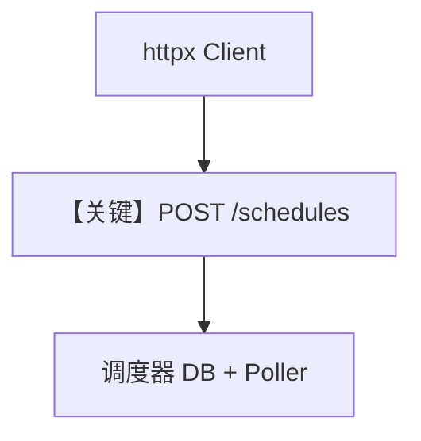

# rest_api_schedules.py — 实现原理分析

> 源文件：`cookbook/05_agent_os/scheduler/rest_api_schedules.py`

## 概述

本示例展示 **httpx 调用 `/schedules` REST**：创建、列表、更新、启停、手动 `trigger`、查看 `runs`、删除；依赖 **已运行** 的 `scheduler_with_agentos.py`。

**核心配置一览：**

| 配置项 | 值 | 说明 |
|--------|------|------|
| `BASE_URL` | `127.0.0.1:7777` | 与 OS 端口一致 |
| JSON 字段 | `cron_expr`, `endpoint`, `payload` | 与路由 schema 对齐 |

## Mermaid 流程图

## 关键源码文件索引

| 文件 | 关键函数/类 | 作用 |
|------|------------|------|
| `agno/os/routers/schedules` | REST | API |
