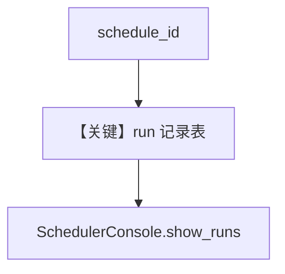

# run_history.py — 实现原理分析

> 源文件：`cookbook/05_agent_os/scheduler/run_history.py`

## 概述

本示例展示 **调度运行历史**：创建 schedule 后**手动插入**模拟 run 记录（生产由 `ScheduleExecutor` 写入），用 `SchedulerConsole.show_runs()` 与分页查询展示状态（success/failed 等）。

**核心配置一览：**

| 配置项 | 值 | 说明 |
|--------|------|------|
| 模拟记录 | `status`, `status_code`, `run_id` | 教学用 |

## Mermaid 流程图

## 关键源码文件索引

| 文件 | 关键函数/类 | 作用 |
|------|------------|------|
| `agno/db/schemas` | scheduler run | 历史 |
