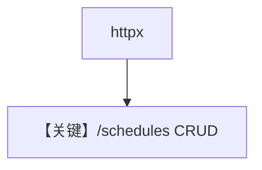

# schedule_management.py — 实现原理分析

<!-- cookbook-py-source:start -->
## 完整源码

```python
"""Schedule management via REST API.

Demonstrates creating, listing, updating, enabling/disabling,
manually triggering, and deleting schedules.

Prerequisites:
    pip install agno[scheduler] httpx

Usage:
    # First, start the server:
    python cookbook/05_agent_os/scheduler/basic_schedule.py

    # Then run this script:
    python cookbook/05_agent_os/scheduler/schedule_management.py
"""

import httpx

# ---------------------------------------------------------------------------
# Create Example
# ---------------------------------------------------------------------------

BASE_URL = "http://localhost:7777"


def main():
    client = httpx.Client(base_url=BASE_URL, timeout=30)

    # 1. Create a schedule
    print("--- Creating schedule ---")
    resp = client.post(
        "/schedules",
        json={
            "name": "hourly-greeting",
            "cron_expr": "0 * * * *",
            "endpoint": "/agents/greeter/runs",
            "payload": {"message": "Hourly check-in"},
            "timezone": "UTC",
            "max_retries": 2,
            "retry_delay_seconds": 30,
        },
    )
    print(f"  Status: {resp.status_code}")
    schedule = resp.json()
    schedule_id = schedule["id"]
    print(f"  ID: {schedule_id}")
    print(f"  Next run at: {schedule['next_run_at']}")
    print()

    # 2. List all schedules
    print("--- Listing schedules ---")
    resp = client.get("/schedules")
    schedules = resp.json()
    for s in schedules:
        print(f"  {s['name']} (enabled={s['enabled']}, next_run={s['next_run_at']})")
    print()

    # 3. Update the schedule
    print("--- Updating schedule ---")
    resp = client.patch(
        f"/schedules/{schedule_id}",
        json={"description": "Runs every hour on the hour", "max_retries": 3},
    )
    print(f"  Updated description: {resp.json()['description']}")
    print()

    # 4. Disable the schedule
    print("--- Disabling schedule ---")
    resp = client.post(f"/schedules/{schedule_id}/disable")
    print(f"  Enabled: {resp.json()['enabled']}")
    print()

    # 5. Re-enable the schedule
    print("--- Enabling schedule ---")
    resp = client.post(f"/schedules/{schedule_id}/enable")
    print(f"  Enabled: {resp.json()['enabled']}")
    print(f"  Next run at: {resp.json()['next_run_at']}")
    print()

    # 6. Manually trigger
    print("--- Triggering schedule ---")
    resp = client.post(f"/schedules/{schedule_id}/trigger")
    print(f"  Trigger status: {resp.status_code}")
    print(f"  Run: {resp.json()}")
    print()

    # 7. View run history
    print("--- Run history ---")
    resp = client.get(f"/schedules/{schedule_id}/runs")
    runs = resp.json()
    print(f"  Total runs: {len(runs)}")
    for run in runs:
        print(
            f"    attempt={run['attempt']} status={run['status']} triggered_at={run['triggered_at']}"
        )
    print()

    # 8. Delete the schedule
    print("--- Deleting schedule ---")
    resp = client.delete(f"/schedules/{schedule_id}")
    print(f"  Delete status: {resp.status_code}")

    # Verify deletion
    resp = client.get(f"/schedules/{schedule_id}")
    print(f"  Get after delete: {resp.status_code} (expected 404)")


# ---------------------------------------------------------------------------
# Run Example
# ---------------------------------------------------------------------------

if __name__ == "__main__":
    main()
```

<!-- cookbook-py-source:end -->

> 源文件：`cookbook/05_agent_os/scheduler/schedule_management.py`

## 概述

本示例为 **httpx 驱动的调度 CRUD 演示**（较 `rest_api_schedules` 更简），先起 `basic_schedule.py` 再在另一终端运行；覆盖 POST/GET/PATCH/enable/disable/trigger/delete。

**核心配置一览：**

| 配置项 | 值 | 说明 |
|--------|------|------|
| `BASE_URL` | `localhost:7777` |  |

## Mermaid 流程图



## 关键源码文件索引

| 文件 | 关键函数/类 | 作用 |
|------|------------|------|
| `agno/os/routers/schedules` | REST | 路由 |
