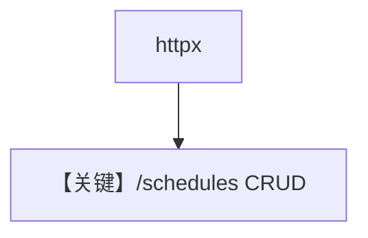

# schedule_management.py — 实现原理分析

> 源文件：`cookbook/05_agent_os/scheduler/schedule_management.py`

## 概述

本示例为 **httpx 驱动的调度 CRUD 演示**（较 `rest_api_schedules` 更简），先起 `basic_schedule.py` 再在另一终端运行；覆盖 POST/GET/PATCH/enable/disable/trigger/delete。

**核心配置一览：**

| 配置项 | 值 | 说明 |
|--------|------|------|
| `BASE_URL` | `localhost:7777` |  |

## Mermaid 流程图

## 关键源码文件索引

| 文件 | 关键函数/类 | 作用 |
|------|------------|------|
| `agno/os/routers/schedules` | REST | 路由 |
