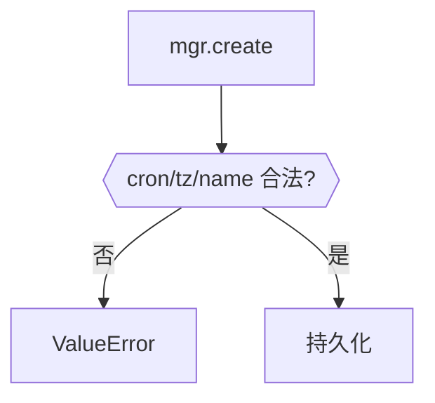

# schedule_validation.py — 实现原理分析

> 源文件：`cookbook/05_agent_os/scheduler/schedule_validation.py`

## 概述

本示例展示 **`ScheduleManager.create` 校验**：非法 cron、非法 timezone、重复 `name` 抛 `ValueError`；合法复杂 cron 模式通过。

**核心配置一览：**

| 配置项 | 值 | 说明 |
|--------|------|------|
| 校验 | cron 字符串 | croniter |

## Mermaid 流程图

## 关键源码文件索引

| 文件 | 关键函数/类 | 作用 |
|------|------------|------|
| `agno/scheduler` | `ScheduleManager` | 校验 |
