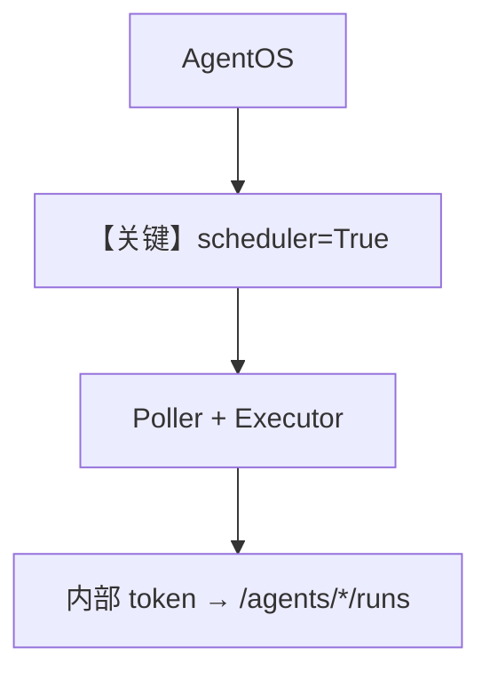

# scheduler_with_agentos.py — 实现原理分析

<!-- cookbook-py-source:start -->
## 完整源码

```python
"""Running the scheduler inside AgentOS with automatic polling.

This example demonstrates the primary DX for the scheduler:
- Setting scheduler=True on AgentOS to enable cron polling
- The poller starts automatically on app startup and stops on shutdown
- Schedules are created via the REST API (POST /schedules)
- The internal service token handles auth between scheduler and agent endpoints

Run with:
    .venvs/demo/bin/python cookbook/05_agent_os/scheduler/scheduler_with_agentos.py
"""

from agno.agent import Agent
from agno.db.sqlite import SqliteDb
from agno.models.openai import OpenAIChat
from agno.os import AgentOS

# --- Setup ---

db = SqliteDb(id="scheduler-os-demo", db_file="tmp/scheduler_os_demo.db")

greeter = Agent(
    name="Greeter",
    model=OpenAIChat(id="gpt-4o-mini"),
    instructions=["You are a friendly greeter."],
    db=db,
)

reporter = Agent(
    name="Reporter",
    model=OpenAIChat(id="gpt-4o-mini"),
    instructions=["You summarize news headlines in 2-3 sentences."],
    db=db,
)

# Create AgentOS with scheduler enabled.
# This does three things:
#   1. Registers the /schedules REST endpoints
#   2. Starts a SchedulePoller on app startup (polls every 15s by default)
#   3. Auto-generates an internal service token for scheduler -> agent auth
agent_os = AgentOS(
    name="Scheduled OS",
    agents=[greeter, reporter],
    db=db,
    scheduler=True,
    scheduler_poll_interval=15,  # seconds between poll cycles (default: 15)
    # scheduler_base_url="http://127.0.0.1:7777",  # default
    # internal_service_token="my-secret",  # auto-generated if omitted
)
app = agent_os.get_app()

# --- Run the server ---
# Once running, create schedules via:
#
#   curl -X POST http://127.0.0.1:7777/schedules \
#     -H "Content-Type: application/json" \
#     -d '{
#       "name": "greet-every-5-min",
#       "cron_expr": "*/5 * * * *",
#       "endpoint": "/agents/greeter/runs",
#       "payload": {"message": "Say hello!"}
#     }'
#
# The poller will pick it up on the next poll cycle and run the agent.

if __name__ == "__main__":
    agent_os.serve(app="scheduler_with_agentos:app", reload=True)
```

<!-- cookbook-py-source:end -->

> 源文件：`cookbook/05_agent_os/scheduler/scheduler_with_agentos.py`

## 概述

本示例为 **调度主 DX**：`AgentOS(scheduler=True, scheduler_poll_interval=15)` 注册 `/schedules`、启动 **SchedulePoller**、生成 **internal service token** 供 executor 调 `background=true` 的 agent runs（见文件注释）。

**核心配置一览：**

| 配置项 | 值 | 说明 |
|--------|------|------|
| `greeter` / `reporter` | `gpt-4o-mini` | 被调度对象 |

## Mermaid 流程图



## 关键源码文件索引

| 文件 | 关键函数/类 | 作用 |
|------|------------|------|
| `agno/os/app.py` | `scheduler` | 集成 |
| `agno/scheduler/poller.py` | Poller | 轮询 |
