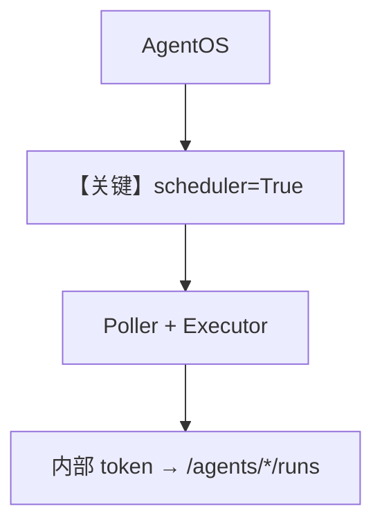

# scheduler_with_agentos.py — 实现原理分析

> 源文件：`cookbook/05_agent_os/scheduler/scheduler_with_agentos.py`

## 概述

本示例为 **调度主 DX**：`AgentOS(scheduler=True, scheduler_poll_interval=15)` 注册 `/schedules`、启动 **SchedulePoller**、生成 **internal service token** 供 executor 调 `background=true` 的 agent runs（见文件注释）。

**核心配置一览：**

| 配置项 | 值 | 说明 |
|--------|------|------|
| `greeter` / `reporter` | `gpt-4o-mini` | 被调度对象 |

## Mermaid 流程图

## 关键源码文件索引

| 文件 | 关键函数/类 | 作用 |
|------|------------|------|
| `agno/os/app.py` | `scheduler` | 集成 |
| `agno/scheduler/poller.py` | Poller | 轮询 |
