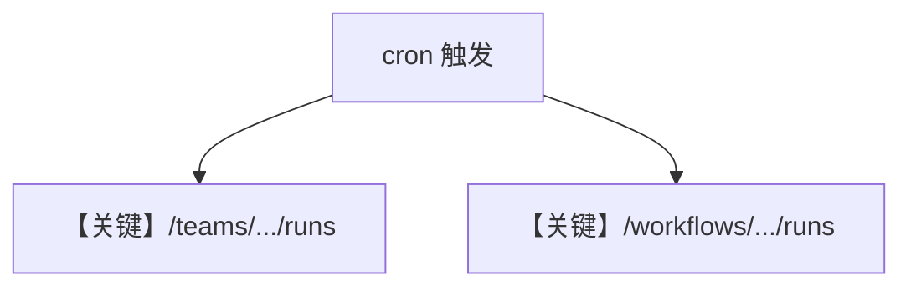

# team_workflow_schedules.py — 实现原理分析

> 源文件：`cookbook/05_agent_os/scheduler/team_workflow_schedules.py`

## 概述

本示例展示 **endpoint 指向 Team / Workflow**：`/teams/research-team/runs` 与 `/workflows/data-pipeline/runs`，`ScheduleManager.create` 配置不同 `timeout_seconds` 与 payload，说明调度器不仅限于 Agent。

**核心配置一览：**

| 配置项 | 值 | 说明 |
|--------|------|------|
| `endpoint` | team/workflow 路径 | 多实体 |

## Mermaid 流程图

## 关键源码文件索引

| 文件 | 关键函数/类 | 作用 |
|------|------------|------|
| `agno/scheduler/executor` | HTTP 调用 | 执行 |
