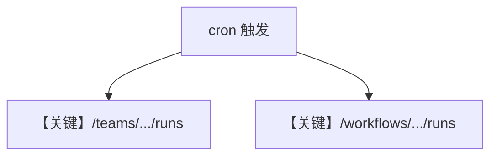

# team_workflow_schedules.py — 实现原理分析

<!-- cookbook-py-source:start -->
## 完整源码

```python
"""Scheduling teams and workflows (not just agents).

This example demonstrates:
- Creating schedules that target team endpoints (/teams/*/runs)
- Creating schedules that target workflow endpoints (/workflows/*/runs)
- Different payload configurations for teams vs workflows
- Using the ScheduleManager directly for setup
"""

from agno.db.sqlite import SqliteDb
from agno.scheduler import ScheduleManager
from agno.scheduler.cli import SchedulerConsole

# --- Setup ---

db = SqliteDb(id="team-wf-demo", db_file="tmp/team_wf_demo.db")
mgr = ScheduleManager(db)
console = SchedulerConsole(mgr)

# =============================================================================
# 1. Schedule a team run
# =============================================================================

print("=== Team Schedules ===\n")

team_schedule = mgr.create(
    name="daily-research-team",
    cron="0 9 * * 1-5",
    endpoint="/teams/research-team/runs",
    description="Run the research team every weekday at 9 AM",
    payload={
        "message": "Research the latest developments in AI safety",
        "stream": False,
    },
    timeout_seconds=1800,
    max_retries=2,
    retry_delay_seconds=60,
)
print(f"Created team schedule: {team_schedule.name}")
console.show_schedule(team_schedule.id)

# =============================================================================
# 2. Schedule a workflow run
# =============================================================================

print("\n=== Workflow Schedules ===\n")

wf_schedule = mgr.create(
    name="nightly-data-pipeline",
    cron="0 2 * * *",
    endpoint="/workflows/data-pipeline/runs",
    description="Run the data pipeline workflow every night at 2 AM",
    payload={
        "message": "Process and aggregate daily data",
    },
    timeout_seconds=3600,
)
print(f"Created workflow schedule: {wf_schedule.name}")
console.show_schedule(wf_schedule.id)

# =============================================================================
# 3. Mix of agent, team, and workflow schedules
# =============================================================================

print("\n=== Mixed Schedules ===\n")

agent_sched = mgr.create(
    name="hourly-monitor",
    cron="0 * * * *",
    endpoint="/agents/monitor-agent/runs",
    description="Run monitor agent every hour",
    payload={"message": "Check system health"},
)

# Show all schedules together
console.show_schedules()

# =============================================================================
# 4. Different HTTP methods for non-run endpoints
# =============================================================================

print("\n=== Non-run endpoint schedules ===\n")

# Schedule a GET request (e.g., health check)
health_sched = mgr.create(
    name="health-ping",
    cron="*/10 * * * *",
    endpoint="/health",
    method="GET",
    description="Ping health endpoint every 10 minutes",
)
print(
    f"Created GET schedule: {health_sched.name} -> {health_sched.method} {health_sched.endpoint}"
)

# =============================================================================
# Cleanup
# =============================================================================

print("\n=== Cleanup ===\n")
for s in mgr.list():
    mgr.delete(s.id)
print("All schedules cleaned up.")
```

<!-- cookbook-py-source:end -->

> 源文件：`cookbook/05_agent_os/scheduler/team_workflow_schedules.py`

## 概述

本示例展示 **endpoint 指向 Team / Workflow**：`/teams/research-team/runs` 与 `/workflows/data-pipeline/runs`，`ScheduleManager.create` 配置不同 `timeout_seconds` 与 payload，说明调度器不仅限于 Agent。

**核心配置一览：**

| 配置项 | 值 | 说明 |
|--------|------|------|
| `endpoint` | team/workflow 路径 | 多实体 |

## Mermaid 流程图



## 关键源码文件索引

| 文件 | 关键函数/类 | 作用 |
|------|------------|------|
| `agno/scheduler/executor` | HTTP 调用 | 执行 |
