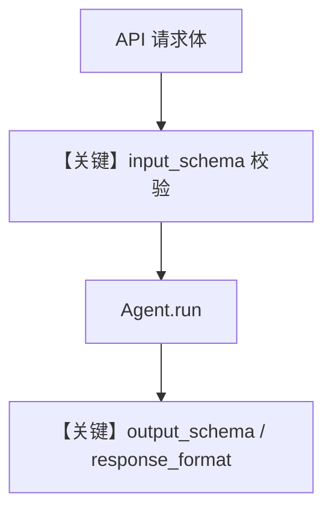

# agent_schemas.py — 实现原理分析

<!-- cookbook-py-source:start -->
## 完整源码

```python
"""
Agent Input And Output Schemas
==============================

Demonstrates AgentOS agents that use input and output schemas.
"""

from typing import List

from agno.agent import Agent
from agno.db.sqlite import SqliteDb
from agno.models.openai import OpenAIChat
from agno.os import AgentOS
from agno.tools.hackernews import HackerNewsTools
from pydantic import BaseModel, Field

# ---------------------------------------------------------------------------
# Setup
# ---------------------------------------------------------------------------
input_schema_db = SqliteDb(
    session_table="agent_session",
    db_file="tmp/agent.db",
)

output_schema_db = SqliteDb(
    session_table="movie_agent_sessions",
    db_file="tmp/agent_output_schema.db",
)


class ResearchTopic(BaseModel):
    """Structured research topic with specific requirements."""

    topic: str
    focus_areas: List[str] = Field(description="Specific areas to focus on")
    target_audience: str = Field(description="Who this research is for")
    sources_required: int = Field(description="Number of sources needed", default=5)


class MovieScript(BaseModel):
    """Structured movie script output."""

    title: str = Field(..., description="Movie title")
    genre: str = Field(..., description="Movie genre")
    logline: str = Field(..., description="One-sentence summary")
    main_characters: List[str] = Field(..., description="Main character names")


# ---------------------------------------------------------------------------
# Create Agents
# ---------------------------------------------------------------------------
hackernews_agent = Agent(
    name="Hackernews Agent",
    model=OpenAIChat(id="gpt-5.2"),
    tools=[HackerNewsTools()],
    role="Extract key insights and content from Hackernews posts",
    input_schema=ResearchTopic,
    db=input_schema_db,
)

movie_agent = Agent(
    name="Movie Script Agent",
    id="movie-agent",
    model=OpenAIChat(id="gpt-5.2"),
    description="Creates structured outputs - default MovieScript format, but can be overridden",
    output_schema=MovieScript,
    markdown=False,
    db=output_schema_db,
)

# ---------------------------------------------------------------------------
# Create AgentOS
# ---------------------------------------------------------------------------
agent_os = AgentOS(
    id="agent-schemas-demo",
    agents=[hackernews_agent, movie_agent],
)
app = agent_os.get_app()

# ---------------------------------------------------------------------------
# Run
# ---------------------------------------------------------------------------
if __name__ == "__main__":
    agent_os.serve(app="agent_schemas:app", port=7777, reload=True)
```

<!-- cookbook-py-source:end -->

> 源文件：`cookbook/05_agent_os/schemas/agent_schemas.py`

## 概述

本示例展示 **AgentOS 下 `input_schema` 与 `output_schema`**：`hackernews_agent` 用 `ResearchTopic` 校验用户输入；`movie_agent` 用 `MovieScript` 结构化输出，`markdown=False` 避免与 JSON 输出冲突。

**核心配置一览：**

| 配置项 | 值 | 说明 |
|--------|------|------|
| `input_schema` | `ResearchTopic` | Pydantic 入参 |
| `output_schema` | `MovieScript` | Pydantic 出参 |
| `tools` | `HackerNewsTools()` | 检索 |

## System Prompt 组装

`output_schema` 影响 `# 3.3.15` 等；`markdown=False` 不追加 markdown 提示。

## Mermaid 流程图



## 关键源码文件索引

| 文件 | 关键函数/类 | 作用 |
|------|------------|------|
| `agno/agent/_messages.py` | `# 3.3.15` | JSON/结构化 |
