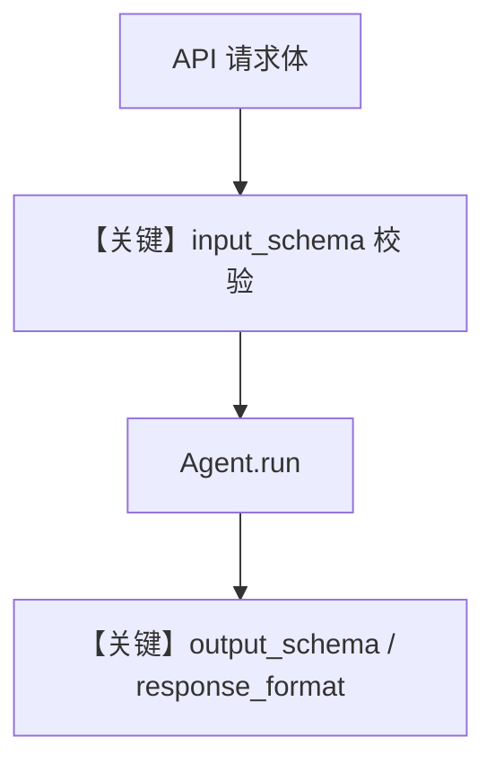

# agent_schemas.py — 实现原理分析

> 源文件：`cookbook/05_agent_os/schemas/agent_schemas.py`

## 概述

本示例展示 **AgentOS 下 `input_schema` 与 `output_schema`**：`hackernews_agent` 用 `ResearchTopic` 校验用户输入；`movie_agent` 用 `MovieScript` 结构化输出，`markdown=False` 避免与 JSON 输出冲突。

**核心配置一览：**

| 配置项 | 值 | 说明 |
|--------|------|------|
| `input_schema` | `ResearchTopic` | Pydantic 入参 |
| `output_schema` | `MovieScript` | Pydantic 出参 |
| `tools` | `HackerNewsTools()` | 检索 |

## System Prompt 组装

`output_schema` 影响 `# 3.3.15` 等；`markdown=False` 不追加 markdown 提示。

## Mermaid 流程图

## 关键源码文件索引

| 文件 | 关键函数/类 | 作用 |
|------|------------|------|
| `agno/agent/_messages.py` | `# 3.3.15` | JSON/结构化 |
