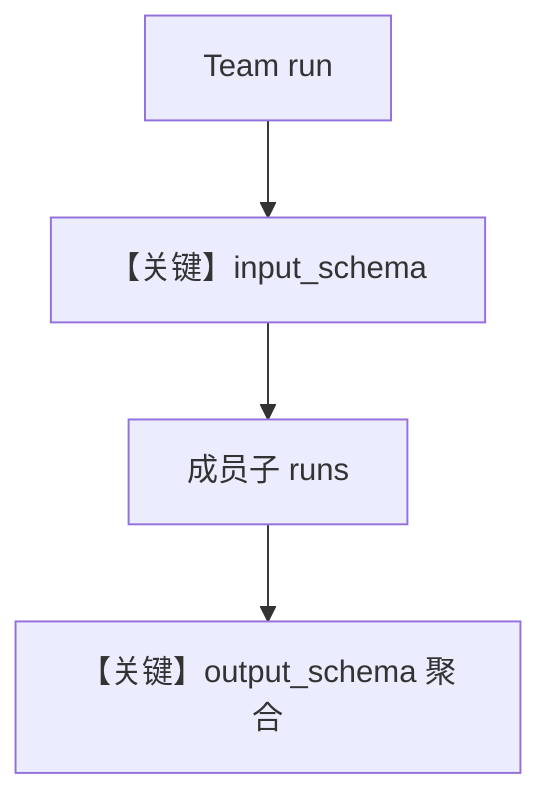

# team_schemas.py — 实现原理分析

> 源文件：`cookbook/05_agent_os/schemas/team_schemas.py`

## 概述

本示例展示 **Team 级 `input_schema` / `output_schema`**：`research_team_with_input_schema` 使用 `ResearchProject` + `delegate_to_all_members=True`；`research_team_with_output_schema` 使用 `ResearchReport` + `markdown=False`。

**核心配置一览：**

| 配置项 | 值 | 说明 |
|--------|------|------|
| `input_schema` | `ResearchProject` | Team 入参校验 |
| `output_schema` | `ResearchReport` | Team 出参结构 |

## System Prompt 组装

走 `agno/team/_messages.py` 的 `get_system_message`，并受 `output_schema` 影响（团队层 JSON 提示逻辑见 team 消息模块）。

## Mermaid 流程图

## 关键源码文件索引

| 文件 | 关键函数/类 | 作用 |
|------|------------|------|
| `agno/team/_messages.py` | `get_system_message` | Team |
