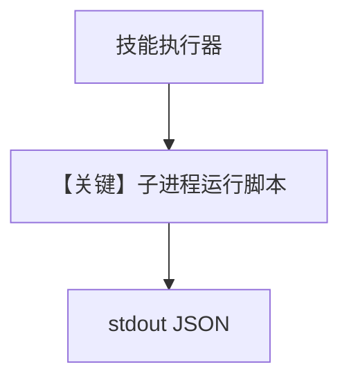

# get_system_info.py — 实现原理分析

> 源文件：`cookbook/05_agent_os/skills/sample_skills/system-info/scripts/get_system_info.py`

## 概述

本文件为 **技能包内可执行脚本**：收集 `platform` / `sys.version` 等信息，**JSON 打印到 stdout**，供 Skills 运行器通过子进程采集；**非** Agno Agent 入口，`__main__` 主动 `SystemExit`。

**核心配置一览：**

| 配置项 | 值 | 说明 |
|--------|------|------|
| 输出 | `json.dumps(info)` | 机器可读 |

## System Prompt 组装

不适用；无 LLM。

## Mermaid 流程图

## 关键源码文件索引

| 文件 | 关键函数/类 | 作用 |
|------|------------|------|
| `agno/skills` | 脚本约定 | stdout 协议 |
