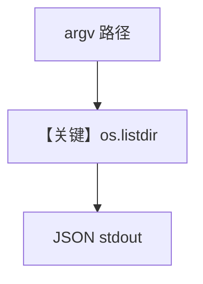

# list_directory.py — 实现原理分析

> 源文件：`cookbook/05_agent_os/skills/sample_skills/system-info/scripts/list_directory.py`

## 概述

本文件为 **目录列举脚本**：从 `sys.argv[1]` 读路径（默认 `.`），列出条目及 `is_dir`/文件大小，**JSON 输出**；错误时打印 `{"error":...}` 并 `sys.exit(1)`。

**核心配置一览：**

| 配置项 | 值 | 说明 |
|--------|------|------|
| CLI 参数 | 可选路径 |  |

## System Prompt 组装

不适用。

## Mermaid 流程图

## 关键源码文件索引

| 文件 | 关键函数/类 | 作用 |
|------|------------|------|
| 本脚本 | `os.listdir` | 列目录 |
