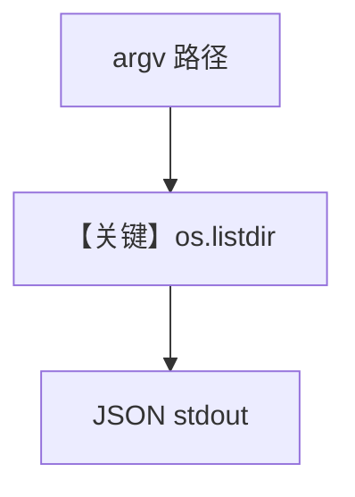

# list_directory.py — 实现原理分析

<!-- cookbook-py-source:start -->
## 完整源码

```python
#!/usr/bin/env python3
"""List files in a directory."""

import json
import os
import sys

# ---------------------------------------------------------------------------
# Create Example
# ---------------------------------------------------------------------------

if len(sys.argv) < 2:
    path = "."
else:
    path = sys.argv[1]

try:
    entries = []
    for entry in os.listdir(path):
        full_path = os.path.join(path, entry)
        entries.append(
            {
                "name": entry,
                "is_dir": os.path.isdir(full_path),
                "size": os.path.getsize(full_path)
                if os.path.isfile(full_path)
                else None,
            }
        )

    result = {
        "path": os.path.abspath(path),
        "count": len(entries),
        "entries": sorted(entries, key=lambda x: (not x["is_dir"], x["name"])),
    }
    print(json.dumps(result, indent=2))
except Exception as e:
    print(json.dumps({"error": str(e)}))
    sys.exit(1)

# ---------------------------------------------------------------------------
# Run Example
# ---------------------------------------------------------------------------

if __name__ == "__main__":
    raise SystemExit("This module is intended to be imported.")
```

<!-- cookbook-py-source:end -->

> 源文件：`cookbook/05_agent_os/skills/sample_skills/system-info/scripts/list_directory.py`

## 概述

本文件为 **目录列举脚本**：从 `sys.argv[1]` 读路径（默认 `.`），列出条目及 `is_dir`/文件大小，**JSON 输出**；错误时打印 `{"error":...}` 并 `sys.exit(1)`。

**核心配置一览：**

| 配置项 | 值 | 说明 |
|--------|------|------|
| CLI 参数 | 可选路径 |  |

## System Prompt 组装

不适用。

## Mermaid 流程图



## 关键源码文件索引

| 文件 | 关键函数/类 | 作用 |
|------|------------|------|
| 本脚本 | `os.listdir` | 列目录 |
