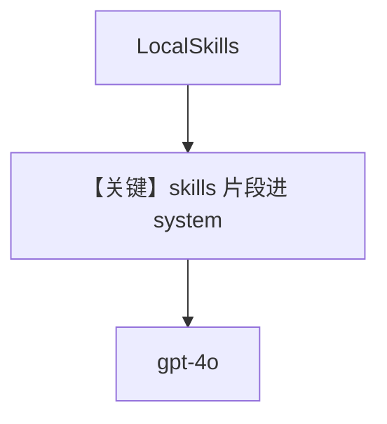

# skills_with_agentos.py — 实现原理分析

<!-- cookbook-py-source:start -->
## 完整源码

```python
"""
Skills With Agentos
===================

Demonstrates skills with agentos.
"""

from pathlib import Path

from agno.agent import Agent
from agno.models.openai import OpenAIChat
from agno.os import AgentOS
from agno.skills import LocalSkills, Skills

# ---------------------------------------------------------------------------
# Create Example
# ---------------------------------------------------------------------------

# Get the skills directory relative to this file
skills_dir = Path(__file__).parent / "sample_skills"

# Create an agent with skills
skills_agent = Agent(
    name="Skills Agent",
    model=OpenAIChat(id="gpt-4o"),
    skills=Skills(loaders=[LocalSkills(str(skills_dir))]),
    instructions=["You are a helpful assistant with access to specialized skills."],
    markdown=True,
)

# Setup AgentOS
agent_os = AgentOS(
    description="Agent with Skills Demo - Execute skill scripts via AgentOS",
    agents=[skills_agent],
)
app = agent_os.get_app()


# ---------------------------------------------------------------------------
# Run Example
# ---------------------------------------------------------------------------

if __name__ == "__main__":
    agent_os.serve(app="skills_with_agentos:app", reload=True)
```

<!-- cookbook-py-source:end -->

> 源文件：`cookbook/05_agent_os/skills/skills_with_agentos.py`

## 概述

本示例展示 **`Skills(loaders=[LocalSkills(skills_dir)])` + AgentOS**：从 `sample_skills` 目录加载技能包，由 `get_system_prompt_snippet()`（`# 3.3.8.1`）注入 system，Agent 可通过技能暴露的脚本能力扩展行为。

**核心配置一览：**

| 配置项 | 值 | 说明 |
|--------|------|------|
| `skills` | `Skills` + `LocalSkills` | 本地技能目录 |
| `instructions` | 列表 | 提示使用技能 |

## System Prompt 组装

含 skills 段（`_messages.py` `# 3.3.8.1`）。

## Mermaid 流程图



## 关键源码文件索引

| 文件 | 关键函数/类 | 作用 |
|------|------------|------|
| `agno/skills` | `Skills`, `LocalSkills` | 加载 |
| `agno/agent/_messages.py` | `# 3.3.8.1` | 注入 |
