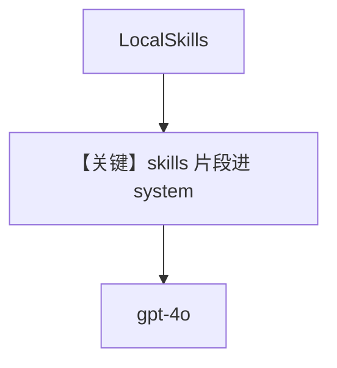

# skills_with_agentos.py — 实现原理分析

> 源文件：`cookbook/05_agent_os/skills/skills_with_agentos.py`

## 概述

本示例展示 **`Skills(loaders=[LocalSkills(skills_dir)])` + AgentOS**：从 `sample_skills` 目录加载技能包，由 `get_system_prompt_snippet()`（`# 3.3.8.1`）注入 system，Agent 可通过技能暴露的脚本能力扩展行为。

**核心配置一览：**

| 配置项 | 值 | 说明 |
|--------|------|------|
| `skills` | `Skills` + `LocalSkills` | 本地技能目录 |
| `instructions` | 列表 | 提示使用技能 |

## System Prompt 组装

含 skills 段（`_messages.py` `# 3.3.8.1`）。

## Mermaid 流程图

## 关键源码文件索引

| 文件 | 关键函数/类 | 作用 |
|------|------------|------|
| `agno/skills` | `Skills`, `LocalSkills` | 加载 |
| `agno/agent/_messages.py` | `# 3.3.8.1` | 注入 |
