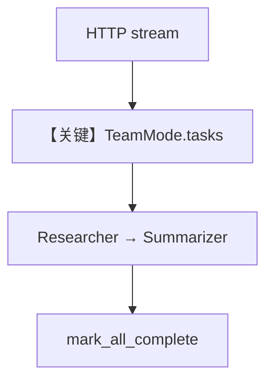

# team_tasks_streaming.py — 实现原理分析

<!-- cookbook-py-source:start -->
## 完整源码

```python
"""Team Task Streaming Demo with AgentOS

This example demonstrates how to expose a Team running in `tasks` mode via AgentOS.
You can use the AgentOS API to send requests and test task streaming.

Usage:
    uv run cookbook/05_agent_os/team_tasks_streaming.py

    Then you can test streaming using curl:
    curl -X POST http://0.0.0.0:7777/v1/teams/research-team/runs/stream \
         -H "Content-Type: application/json" \
         -d '{"message": "What are the key benefits of microservices architecture?"}'
"""

from agno.agent import Agent
from agno.db.postgres import PostgresDb
from agno.models.openai import OpenAIChat
from agno.os import AgentOS
from agno.team.mode import TeamMode
from agno.team.team import Team

# ---------------------------------------------------------------------------
# Create Database
# ---------------------------------------------------------------------------

db = PostgresDb(db_url="postgresql+psycopg://ai:ai@localhost:5532/ai")

# ---------------------------------------------------------------------------
# Create Members
# ---------------------------------------------------------------------------

researcher = Agent(
    name="Researcher",
    role="Researches topics and gathers information",
    model=OpenAIChat(id="gpt-5-mini"),
    db=db,
    instructions=[
        "Research the given topic thoroughly.",
        "Provide factual information.",
    ],
)

summarizer = Agent(
    name="Summarizer",
    role="Summarizes information into concise points",
    model=OpenAIChat(id="gpt-5-mini"),
    db=db,
    instructions=["Create clear, concise summaries.", "Highlight key points."],
)

# ---------------------------------------------------------------------------
# Create Team
# ---------------------------------------------------------------------------

team = Team(
    id="research-team",
    name="Research Team",
    mode=TeamMode.tasks,
    model=OpenAIChat(id="gpt-5-mini"),
    members=[researcher, summarizer],
    db=db,
    instructions=[
        "You are a research team leader. Follow these steps exactly:",
        "1. Create ALL tasks for the Researcher to gather information.",
        "2. Create ALL tasks for the Summarizer to summarize the research.",
        "3. Execute the Researcher's task.",
        "4. Execute the Summarizer's task.",
        "5. Call mark_all_complete with a final summary when all tasks are done.",
    ],
    max_iterations=3,
)

# ---------------------------------------------------------------------------
# AgentOS
# ---------------------------------------------------------------------------

agent_os = AgentOS(
    name="Team Tasks Streaming Demo",
    teams=[team],
)
app = agent_os.get_app()

# ---------------------------------------------------------------------------
# Run
# ---------------------------------------------------------------------------

if __name__ == "__main__":
    agent_os.serve(app="team_tasks_streaming:app", port=7777, reload=True)
```

<!-- cookbook-py-source:end -->

> 源文件：`cookbook/05_agent_os/team_tasks/team_tasks_streaming.py`

## 概述

本示例展示 **`TeamMode.tasks` + AgentOS 流式 API**：`Team` 以任务列表方式驱动 researcher/summarizer，`max_iterations=3`；文档示例 curl 指向 **`/v1/teams/research-team/runs/stream`** 测任务流。

**核心配置一览：**

| 配置项 | 值 | 说明 |
|--------|------|------|
| `mode` | `TeamMode.tasks` | 任务模式 |
| `instructions` | 分步队长指令 | 创建/执行任务顺序 |

## System Prompt 组装

Team `get_system_message` + tasks 模式附加说明（见 `agno/team` 任务模式实现）。

## Mermaid 流程图



## 关键源码文件索引

| 文件 | 关键函数/类 | 作用 |
|------|------------|------|
| `agno/team/mode` | `TeamMode.tasks` | 模式 |
| `agno/team` | 任务循环 | 执行 |
