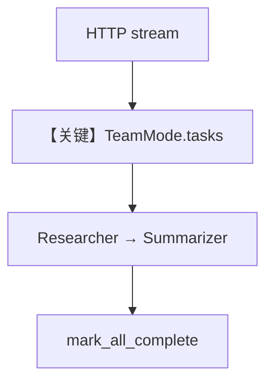

# team_tasks_streaming.py — 实现原理分析

> 源文件：`cookbook/05_agent_os/team_tasks/team_tasks_streaming.py`

## 概述

本示例展示 **`TeamMode.tasks` + AgentOS 流式 API**：`Team` 以任务列表方式驱动 researcher/summarizer，`max_iterations=3`；文档示例 curl 指向 **`/v1/teams/research-team/runs/stream`** 测任务流。

**核心配置一览：**

| 配置项 | 值 | 说明 |
|--------|------|------|
| `mode` | `TeamMode.tasks` | 任务模式 |
| `instructions` | 分步队长指令 | 创建/执行任务顺序 |

## System Prompt 组装

Team `get_system_message` + tasks 模式附加说明（见 `agno/team` 任务模式实现）。

## Mermaid 流程图

## 关键源码文件索引

| 文件 | 关键函数/类 | 作用 |
|------|------------|------|
| `agno/team/mode` | `TeamMode.tasks` | 模式 |
| `agno/team` | 任务循环 | 执行 |
