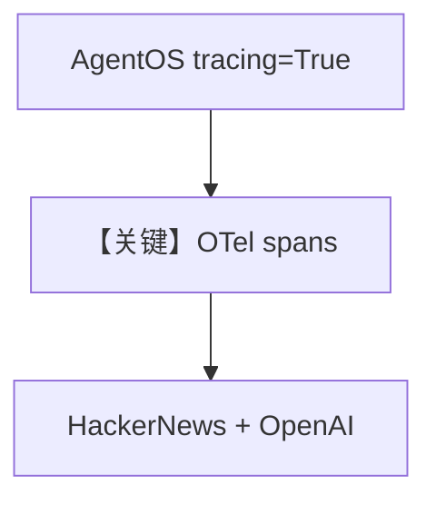

# 01_basic_agent_tracing.py — 实现原理分析

> 源文件：`cookbook/05_agent_os/tracing/01_basic_agent_tracing.py`

## 概述

本示例展示 **`AgentOS(tracing=True)`** 与 OpenTelemetry/OpenInference 依赖：在 AgentOS 应用上启用 **追踪导出**（具体 exporter 由框架与环境配置），`HackerNewsTools` Agent 作为被观测业务。

**核心配置一览：**

| 配置项 | 值 | 说明 |
|--------|------|------|
| `tracing` | `True` | 启用 |
| 依赖 | 见文件头 comment | otel + openinference |

## 运行机制与因果链

追踪跨度覆盖 `Agent.run` → 工具 → 模型调用（由 instrumentation 自动嵌套）。

## System Prompt 组装

```text
You are a hacker news agent. Answer questions concisely.
```

## Mermaid 流程图



## 关键源码文件索引

| 文件 | 关键函数/类 | 作用 |
|------|------------|------|
| `agno/os` | `AgentOS(tracing=...)` | 开关 |
