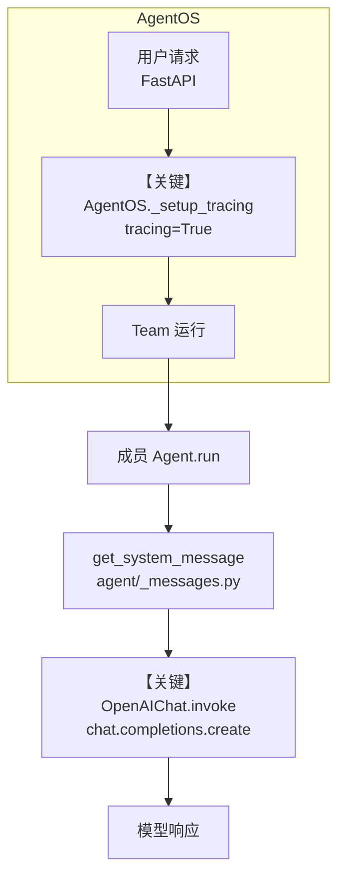

# 02_basic_team_tracing.py — 实现原理分析

> 源文件：`cookbook/05_agent_os/tracing/02_basic_team_tracing.py`

## 概述

本示例展示 Agno 的 **AgentOS 级 tracing** 与 **Team 编排**：在 `AgentOS(tracing=True)` 下无需给每个 `Agent` 单独开 tracing，由 OS 统一调用 `setup_tracing_for_os`，将 OpenTelemetry 导出到与 Team 共享的 `db`。

**核心配置一览：**

| 配置项 | 值 | 说明 |
|--------|------|------|
| `db` | `SqliteDb(db_file="tmp/traces.db")` | Team 会话/存储库，亦为 tracing 落库的候选库 |
| `agent` | `Agent(...)` | 成员 Agent，显式参数见下表 |
| `team` | `Team(...)` | 协调层，显式参数见下表 |
| `agent_os` | `AgentOS(teams=[team], tracing=True)` | 启用 OS 级追踪 |
| `app` | `agent_os.get_app()` | FastAPI 应用 |
| `agent.name` | `"HackerNews Agent"` | 成员名称 |
| `agent.model` | `OpenAIChat(id="gpt-5.2")` | Chat Completions API |
| `agent.tools` | `[HackerNewsTools()]` | Hacker News 工具 |
| `agent.instructions` | `"You are a hacker news agent..."` | 成员指令 |
| `agent.markdown` | `True` | 启用 Markdown 相关 system 附加段 |
| `team.name` | `"HackerNews Team"` | Team 名称 |
| `team.model` | `OpenAIChat(id="gpt-5.2")` | Team 主模型（Chat Completions） |
| `team.members` | `[agent]` | 单成员 |
| `team.instructions` | `"You are a hacker news team..."` | Team 级指令 |
| `team.db` | `db` | 与 tracing 共享同一 Sqlite |
| `description` | `"Example app for tracing HackerNews"` | AgentOS 描述 |
| `tracing` | `True` | 开启追踪 |

## 架构分层

```
用户代码层                agno.os / agno.team 层
┌──────────────────┐    ┌──────────────────────────────────┐
│ AgentOS          │    │ AgentOS.__init__                 │
│ tracing=True     │───>│  _setup_tracing() L616+          │
│ teams=[team]     │    │   setup_tracing_for_os(db)      │
│                  │    │    agno/os/utils.py L989+        │
│ Team + Agent     │    │ Team.run / 成员 Agent.run        │
│ db=SqliteDb      │    │  get_system_message (Team/Agent)  │
└──────────────────┘    └──────────────────────────────────┘
                                │
                                ▼
                        ┌──────────────┐
                        │ OpenAIChat   │
                        │ gpt-5.2      │
                        │ chat.py invoke L385+             │
                        └──────────────┘
```

## 核心组件解析

### AgentOS 与 tracing

`AgentOS` 在 `tracing=True` 时于初始化末尾调用 `_setup_tracing()`（`agno/os/app.py` 约 L334–335、L616–654）：优先使用 `AgentOS.db`，否则回退到第一个带 `db` 的 agent/team/workflow；随后 `setup_tracing_for_os(db=self.db)`（`agno/os/utils.py` 约 L989+）配置导出器，将 span 写入数据库。

### Team 的 System 消息

Team 侧默认 system 由 `get_system_message()`（`agno/team/_messages.py` 约 L328+）拼装：若未自定义 `system_message` 且 `build_context` 为默认真，则合并 `instructions`、模型附加指令、markdown/datetime 等附加段（见同文件 L385+ 起）。

### 成员 Agent 的 System 消息

成员 Agent 仍走 `agno/agent/_messages.py` 的 `get_system_message()`（约 L106+）：分段注释 `# 3.1`～`# 3.3.9` 描述 description、role、instructions、`<additional_information>`、工具说明等。

### 运行机制与因果链

1. **数据路径**：HTTP/API 进入 AgentOS → 路由到 Team 运行 → Team 调度成员 → 成员 `Agent` 调用 `OpenAIChat.invoke`，消息列表含 `get_system_message` 产出与用户输入。
2. **状态与副作用**：`SqliteDb` 持久化会话与 trace；`tracing=True` 时 span 写入同一或回退 db。
3. **关键分支**：若 `AgentOS` 未传 `db` 且所有实体均无 `db`，`_setup_tracing` 会记录警告并跳过（`app.py` 约 L647–652）。
4. **与相邻示例差异**：本文件强调「Team + OS 级 tracing」，与单 Agent tracing 相比多了 Team 层 system 与协调 span。

## System Prompt 组装

### Team 协调器（当前 run 参照：用户经 Team 提问）

| 序号 | 组成部分 | 本文件中的值/来源 | 是否生效 |
|------|---------|-----------------|---------|
| 1 | `team.system_message` | 未设置（默认拼装） | 否（走默认分支） |
| 2 | `team.instructions` | `"You are a hacker news team. Answer questions concisely using HackerNews Agent member"` | 是 |
| 3 | `team.markdown` | 默认未显式设置（默认行为依 Team 定义） | 视默认 |
| 4 | 模型附加指令 | `team.model.get_instructions_for_model(tools)` | 视调用时 tools |

### 成员 Agent（被 Team 调用时）

| 序号 | 组成部分 | 本文件中的值/来源 | 是否生效 |
|------|---------|-----------------|---------|
| 1 | `description` | 未设置 | 否 |
| 2 | `instructions` | `"You are a hacker news agent. Answer questions concisely."` | 是 |
| 3 | `markdown` | `True` → 附加 “Use markdown to format your answers.” | 是 |

### 拼装顺序与源码锚点（成员 Agent，默认路径）

1. `# 3.1` 收集 `instructions`（`agno/agent/_messages.py` 约 L162–174）
2. `# 3.1.1` 模型指令（约 L176–179）
3. `# 3.2.1` markdown 附加（约 L183–185）
4. `# 3.3.1`–`# 3.3.3` description / role / instructions 写入正文（约 L233–255）— 本示例无 description/role
5. `# 3.3.4` additional_information（约 L256–261）

Team 侧顺序见 `team/_messages.py` 中 `get_system_message` 从 L385 起的对称逻辑。

### 还原后的完整 System 文本（成员 Agent，静态可确定部分）

```text
You are a hacker news agent. Answer questions concisely.

<additional_information>
- Use markdown to format your answers.
</additional_information>
```

（若运行时注入工具说明、记忆等，需调试 `get_system_message` 返回前内容。）

### 段落释义（模型视角）

- **instructions**：约束回答风格与领域（Hacker News 助手）。
- **markdown 附加段**：要求用 Markdown 排版，便于 API 消费者渲染。

### 与 User / Developer 消息的边界

用户问题经 Team 进入成员时，用户消息在 `user` role；system 为上述拼装结果；`OpenAIChat` 使用 `chat.completions.create` 的 `messages` 数组（`agno/models/openai/chat.py` 约 L412–414）。

## 完整 API 请求

```python
# OpenAIChat → Chat Completions（agno/models/openai/chat.py invoke 约 L412+）
provider_response = client.chat.completions.create(
    model="gpt-5.2",
    messages=[
        # role=system: 来自 get_system_message（成员 Agent）
        {"role": "system", "content": "<见上一节还原文本+运行时工具段>"},
        # role=user: 来自 Team/路由传入的最终任务文本
        {"role": "user", "content": "<用户输入>"},
    ],
    # tools: HackerNewsTools 序列化结果（若本步启用工具）
)
```

> 与第 5 节 system 正文对应；history 若启用则插入 system/user 之间（本示例 Agent 未设 `add_history_to_context`）。

## Mermaid 流程图



- **【关键】_setup_tracing**：本示例核心演示 OS 级启用追踪与 db 绑定。
- **【关键】invoke**：实际 LLM 调用形态。

## 关键源码文件索引

| 文件 | 关键函数/类 | 作用 |
|------|------------|------|
| `agno/os/app.py` | `AgentOS._setup_tracing()` L616–654 | tracing 启用与 db 选择 |
| `agno/os/utils.py` | `setup_tracing_for_os()` L989+ | 绑定导出器 |
| `agno/team/_messages.py` | `get_system_message()` L328+ | Team system 拼装 |
| `agno/agent/_messages.py` | `get_system_message()` L106+ | Agent system 拼装 |
| `agno/models/openai/chat.py` | `OpenAIChat.invoke()` L385+ | Chat Completions 请求 |
